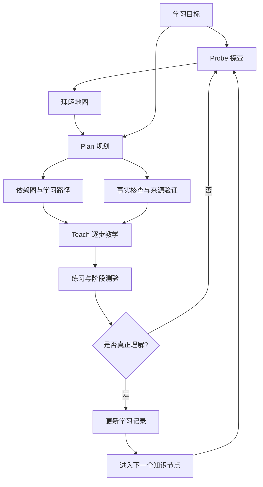

# [中配] 我如何使用 AI 进行高效学习

> **视频**：[我如何使用AI进行高效学习](https://www.bilibili.com/video/BV1Y7bR6nEBv/)  
> **原标题**：How I Use AI to Learn Things  
> **UP 主**：豚工智能｜**发布**：2026-08-17｜**时长**：37:58  
> **事实主干**：B站 AI 字幕（agent-reach / OpenCLI，352 段时间轴字幕）  
> **证据等级**：`bilibili-ai-subtitles`；视频中的系统名称和专有名词按上下文整理

---

## 一句话总论

> **AI 学习系统的目标不是替人“讲完更多内容”，而是先测出学习者的真实理解边界，再规划一条只经过必要知识节点的路径，用可信、逐步、可反馈的教学让学习者真正掌握。**

视频提出一种可工程化的个人 AI 教师：它把多源知识聚合到一个可信界面，通过 `Probe → Plan → Teach` 流程持续了解学习者、安排课程、一步一步教学，并用测试和实践校准系统。

## 核心概念速览

| 概念 | 含义 |
| --- | --- |
| **Optimized Teaching（优化教学）** | 教学内容和路径精准落在学习者当前理解边缘，跳过已掌握内容，也不贸然跳到暂时无法理解的内容 |
| **Optimized Allocation of Mental Resources（心理资源优化分配）** | 把认知努力集中在学习材料本身，而不是寻找资源、切换界面、验证来源和安排顺序 |
| **Probe（探查）** | 用分级测验建立学习者当前理解地图，找到知识依赖图上的边界 |
| **Plan（规划）** | 根据理解地图、目标和依赖关系生成学习路径，并先做事实核查 |
| **Teach（教学）** | 一次推进一个可消化的推理步骤，随时允许提问，并周期性测试理解 |
| **Feedback（反馈）** | 通过测验、练习和学习记录判断是否真的学会，持续修正教学计划 |

---

## 一、传统学习为什么低效

### 1. 教学来源与学习者是多对多

传统学习中，每位老师、书籍或课程都要面向很多学生设计；每个学生又要从多个来源学习。于是形成多对多关系：

```text
多个教学来源  ↔  一个学习者  ↔  多个教学来源
```

这种结构有两个方向的低效。

### 2. 第一种低效：统一内容无法适配每个人

一个来源要同时教很多人，不可能对任何一个人都是最优。对单个学习者来说，统一课程经常会：

- 重复已经掌握的概念；
- 在基础缺失时直接跳到过难内容；
- 以固定顺序推进，而不是按当前理解状态推进；
- 让学习者花时间等待、跳过或自行补洞。

这对应 **Optimized Teaching**：最优教学取决于学习者当前的理解边缘，以及从当前理解到目标理解之间的完整路径。

### 3. 第二种低效：多来源切换消耗心理资源

学习者从多个来源获取知识，需要适应不同的：

- 教学风格；
- 符号体系和术语；
- 可信度水平；
- 阅读界面和交互方式。

这些切换会消耗本应投入学习材料的认知资源。更深层的问题是**信任**：面对不熟悉的来源，大脑会先保持观望，只有在来源证明可靠后才完全接受知识。

视频用“同一份毛球定理讲解来自熟悉的 3Blue1Brown，还是来自一个普通 X 用户”来说明：内容相同，学习效果仍会因来源信任不同而不同。

### 4. 理想状态：来源可以多，界面应该统一

“一个学生只对应一位老师”并不意味着只能有一个知识来源。更合理的解释是：

> **由一个可信的教学界面聚合多个来源、多个视角，再根据当前学习者的状态统一传递。**

AI 教师的优势不是减少知识来源，而是把来源聚合、过滤、解释和排序的后勤工作从学习者身上移走。

---

## 二、两个系统原则

### 1. 优化教学：在理解边缘工作

教学路径应尽量：

1. 减少学习者已经掌握的内容；
2. 不跳到当前无法理解的内容；
3. 补齐实现目标所必需的前置知识；
4. 每一步都能让学习者感到“有挑战但可继续”。

这与“把所有知识一次性倒给模型或学生”相反。课程的最优单位不是一篇完整文章，而是**当前这个人下一步真正需要理解的概念**。

### 2. 心理资源优化分配：后勤交给系统

优化资源分配不是把学习变得没有难度。真正应该被最大化的是对材料本身的挣扎：

- 可以在一个困难概念上花时间；
- 不应把时间浪费在找资料、确认来源、决定先学什么、切换工具和整理记录上；
- 学习者需要面对内容的困难，而不是面对系统的混乱。

> **AI 不应替学习者消除所有困难，而应把非学习性的摩擦降到最低。**

---

## 三、信任必须被工程化

当 AI 担任老师时，信任不能只靠长期相处慢慢建立，而要内置在系统中：

- 关键知识有可靠来源；
- 输出经过事实核查和一致性检查；
- 系统能识别不确定内容，而不是用流畅语言掩盖错误；
- 学习路径和依据对学习者可见；
- 每次学习记录都能追溯到对应材料和推理步骤。

信任有两个直接作用：

1. 当然是降低幻觉和错误信息的风险；
2. 让学习者不必反复怀疑“这句话可靠吗”，把心理资源用在理解内容上。

视频展示的事实核查子智能体主要在规划阶段启动。数学学习中事实核查的必要性可能较低，但把它作为系统能力保留，有利于迁移到历史、医学、工程等事实密集领域。

---

## 四、核心闭环：Probe → Plan → Teach



### 阶段 1：Probe——建立理解地图

系统不能假设学习者“应该知道什么”，必须先测量当前状态。视频的做法是分级多选测验：

1. 先从宽泛问题开始，定位大致水平；
2. 沿课程依赖的每条知识线继续提问；
3. 用二分搜索逼近理解边缘；
4. 将答案、置信度和暴露出的误解整理成理解地图。

这样得到的不是一个简单的分数，而是一张可用于规划的知识状态图：哪些节点已经掌握、哪些节点只会表面定义、哪些前置概念存在缺口、哪些路径可以跳过。

### 阶段 2：Plan——把目标变成可解释路径

规划阶段需要综合：

- 学习目标；
- 理解地图；
- 知识依赖关系；
- 学习者偏好的教学方式；
- 可信资源和事实核查结果。

视频让系统把规划输出为 Mermaid 图，原因有两个：

1. 让学习者提前看到后续内容和目标路径，形成清晰预期；
2. 强迫 AI 把依赖关系和推理过程显式化，降低“随便编一条课程路径”的概率。

规划不是一次性生成后永久不变。每次测验和练习都可能暴露新的缺口，路径应允许回退、插入前置知识或跳过已掌握节点。

### 阶段 3：Teach——一次只推进一个推理步骤

普通聊天式教学常见的问题是：模型一兴奋就把整章内容一次性倒出来。视频刻意要求系统：

- 每次只推进一个推理步骤；
- 解释后立刻检查是否理解；
- 允许学习者在任意节点提问；
- 不因学习者暂时沉默就跳过中间推导；
- 在前一步没有稳定掌握前，不继续堆叠新概念。

逐步教学的价值在于降低每次更新的认知跨度，让学习者可以随时定位“不懂的具体一步”，而不是面对一整段无法拆解的答案。

---

## 五、反馈为什么是教学系统的核心

AI 需要定期测试，而不是只问“听懂了吗”。视频给出三个理由：

1. **人很容易自我欺骗**：读懂解释、点头或觉得熟悉，不代表能够独立回忆和应用；
2. **系统需要校准**：新的答案能修正理解地图和后续路径；
3. **应用会固化理解**：练习题和实际应用把新信息转成可调用能力。

因此反馈至少应包括：

| 反馈形式 | 作用 |
| --- | --- |
| 分级测验 | 检查概念是否真正理解，定位边界 |
| 追问与解释 | 观察学习者的推理过程，而不是只看选项 |
| 练习题 | 检查能否迁移到新问题 |
| 阶段回顾 | 判断哪些内容需要复习、跳过或重新规划 |
| 学习记录 | 让下次会话继续使用真实状态 |

> **反馈不是课程结束后的评分，而是课程运行时的控制信号。**

---

## 六、实战演示：用系统学习微分形式

### 学习目标

视频选择“微分形式”作为真实案例。学习者此前只知道麦克斯韦方程组可以用微分形式简化为两个方程，但对微分形式本身几乎不了解。

### 学习工作区

演示在一个以 Obsidian 为界面的学习目录中完成，主要组件包括：

- **Markdown 学习记录**：每次学习永久保存，便于跨会话继续；
- **日志扩展**：把 Markdown 文件关联到当前会话，把对话和思考过程打印进笔记；
- **LaTeX 渲染**：直接展示公式；
- **可视化工具和子智能体**：生成 SVG/图解，并检查图像是否正确；
- **测验扩展**：在教学节点后发题，确认是否理解。

### 探查阶段的题目类型

系统先通过问题定位理解程度，例如：

- 线积分表示什么？
- 向量场某点的散度表示什么？
- 斯托克斯定理如何理解？
- 法拉第感应定律与电磁场变换有什么关系？

学习者可以随时把自己的想法写进当前笔记，作为额外上下文。这样系统不仅看到答案，还能看到学习者为什么选择某个答案，以及误解发生在哪里。

### 规划和教学阶段

系统先规划到广义斯托克斯定理的路径，再逐步引入：

1. 余向量；
2. 余向量场；
3. 一形式与一维对象上的积分；
4. 二形式及其与曲面相关的对象；
5. 反对称、双线性等结构；
6. 广义斯托克斯定理。

每次只讲一个推理步骤，然后用小问题检查理解，再把生成的 SVG 图和 LaTeX 公式嵌入 Obsidian。子智能体负责生成和检查图像，主教学流程保持在当前概念上下文中。

视频中学习者认为“一次只前进一个推理步骤”尤其有效：随时可以提问，系统不会因为一个问题停顿就把后续全部跳过去。

---

## 七、系统设计要点

### 1. 让学习者定义学习理念

教学阶段不能只靠模型默认风格。学习者应能表达：

- 喜欢直觉解释还是形式化推导；
- 是否需要图像、例子、反例或类比；
- 希望一次学习多长时间；
- 更重视概念理解、解题能力还是实际应用；
- 是否接受“先给结论再补证明”。

系统应把这些偏好作为长期状态，而不是每次重新解释。

### 2. 记录“学习者状态”，不只记录聊天内容

有价值的状态字段可能包括：

- 目标和截止时间；
- 已掌握知识节点；
- 误解和易错点；
- 最近一次测验结果；
- 已完成路径和未完成路径；
- 偏好的教学方式；
- 事实核查和资源来源；
- 下一次应从哪里继续。

这使系统从“会话问答”升级为“有状态的学习 Agent”。

### 3. 把规划图作为可审查的中间产物

规划图不仅是给学习者看的 UI，也是一种约束：

- 学习者可以发现路径缺失或顺序不合理；
- AI 必须显式列出依赖关系；
- 后续可以比较计划与实际学习轨迹；
- 复习时可以从图中选择任意前置节点。

### 4. 让子智能体承担局部、可验证的工作

演示中的子智能体用于事实核查、可视化生成和图像检查，而不是让多个 Agent 无边界地共同教学。适合拆出的工作应满足：

- 输入输出边界清晰；
- 结果可以自动或人工验证；
- 失败不会破坏主教学状态；
- 需要独立上下文或专门工具。

如果只是为了“看起来像多 Agent”而拆分，通信成本和调试复杂度可能超过收益。

---

## 八、与普通 AI 问答的区别

| 普通 AI 问答 | 个性化 AI 教师系统 |
| --- | --- |
| 用户问一个问题，模型直接回答 | 先探查理解状态，再安排下一步 |
| 一次输出大量内容 | 每次只推进一个推理步骤 |
| 默认用户已理解前置知识 | 显式维护知识依赖和理解地图 |
| 只看回答是否流畅 | 用测验、练习和追问验证是否学会 |
| 每次会话重新开始 | 保存目标、进度、误解和学习记录 |
| 多来源由用户自己筛选 | AI 聚合来源并承担检索、核查和排序 |
| 错误和来源可信度不透明 | 通过事实检查和来源溯源建立信任 |

核心变化不是“Prompt 写得更长”，而是增加了**状态、测量、规划、反馈和持久化**。

---

## 九、可迁移的设计原则

1. **先测量，再教学**：没有当前状态，就没有真正的个性化；
2. **用依赖图而不是目录组织课程**：学习顺序由前置关系和目标决定；
3. **把计划显式化**：图和结构化计划既帮助用户预期，也约束模型；
4. **把认知难度留给内容**：系统消除后勤摩擦，不替学习者消除必要的思考；
5. **一次只推进可验证的小步**：降低上下文跳跃，及时暴露误解；
6. **把反馈当控制回路**：测验结果要改变后续课程，而不是只生成分数；
7. **信任需要工程保障**：来源、核查、状态和记录比“说话像老师”更重要；
8. **保留多源视角，统一交互界面**：聚合不等于抹平分歧；
9. **子 Agent 负责局部可验证任务**：生成图、查事实、做测验都要有明确边界；
10. **学习记录是系统记忆**：没有持久状态，就只能得到一次性聊天，而不是长期教师。

---

## 十、局限与待验证问题

视频展示的是一个很有说服力的个人学习系统，但仍有一些问题需要实际评估：

- **测验质量**：分级多选题能否准确测出深层理解，还是只测出识别能力？
- **理解地图的可靠性**：学习者可能蒙对、过度自信或在题型变化后暴露新误解；
- **规划的稳定性**：知识图谱、资源版本和模型变化后，路径是否会频繁漂移？
- **事实核查成本**：对数学以外的领域，核查 Agent 的来源和判断本身如何验证？
- **教学效果归因**：学习变好是因为逐步教学、可视化、测试，还是因为学习者本来就投入更多时间？
- **长期状态维护**：学习者的目标、偏好和掌握程度都会变化，旧状态如何降权和更新？
- **模型依赖**：视频使用高能力模型，换成更便宜的模型后教学质量是否仍能接受？
- **知识边界**：系统如何处理来源冲突、尚无定论或需要专家指导的内容？

因此，这个方案更像一套值得原型验证的系统设计原则，而不是已经被严格评测的学习科学结论。

---

## 🔗 相关笔记

- [[Clippings/Bilibili/2026-07-31-Matt-Pocock实战-teach-skill让AI像真老师]]：同样关注有状态 AI 教师、最近发展区和学习工作区，可对照本文的 Probe-Plan-Teach 设计。
- [[Clippings/Bilibili/2026-08-20-AI-Agent面试复盘-从框架到可靠系统]]：从 Agent 工程和评估角度补充“状态、工具、边界、反馈闭环”。
- [[Clippings/Bilibili/2026-08-04-保姆教程-卡帕西LLM-Wiki强在哪]]：讨论 AI 如何把多源资料编译成可持续维护的个人知识库。
- [[Clippings/Bilibili/2026-08-17-Matt-Pocock实战-5条Prompt搭建MCP-Server]]：关于让 AI 读取结构化上下文、通过文件和工具持续工作的实践。
- [[领域/AI Agent 智能体学习路线 2026]]：从 LLM、RAG、Workflow、Memory 到 Multi-Agent 的学习路径。

---

## 字幕与术语说明

字幕存在中英文混合识别和专有名词误识别，例如 `Pagent`、`Claude`、`Obsidian`、`LaTeX`、`Mermaid`、`SVG`、`Probe`、`Plan`、`Teach` 等。笔记按上下文统一为规范术语；视频中的个人体验、系统效果和教学理念属于作者分享，不等同于独立实验结论。
