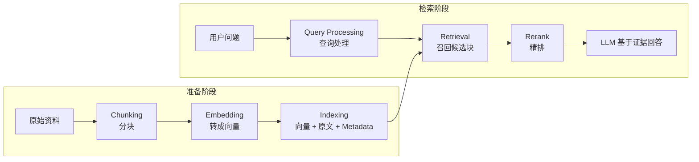
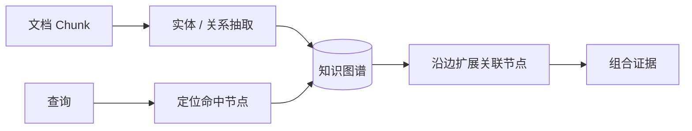
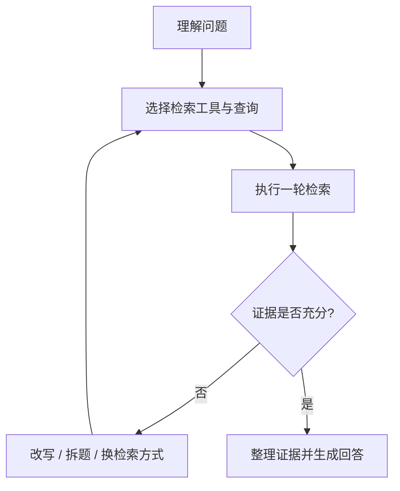
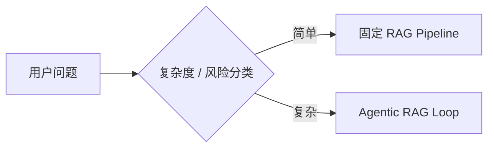

# 7 分钟了解 10 种 RAG 策略

> **视频**：[7 分钟了解 10 种 RAG 策略](https://www.bilibili.com/video/BV17J3B6PEGK/)  
> **UP 主**：Hucci写代码｜**发布**：2026-07-30｜**时长**：07:31  
> **事实主干**：视频音频离线转写（faster-whisper small，中文）  
> **证据等级**：`local-asr-transcript`；英文术语和明显近音错误已结合上下文校正

## 一句话总论

> **RAG 优化不是寻找一个万能组件，而是针对“分块、向量化、索引、查询处理、召回和架构路由”各阶段的失败模式逐层补强；刚开始落地时，视频建议优先采用 `Hybrid Search + Rerank`。**

视频介绍了 10 种常见策略：

| 阶段 | 策略 |
| --- | --- |
| 分块 | Semantic Chunking、Proposition Chunking |
| 向量化 | Domain-specific Embedding |
| 索引 | GraphRAG |
| 查询处理 | Query Transformation、HyDE |
| 召回与精排 | Hybrid Search、Rerank |
| 整体架构 | Agentic RAG、Adaptive Routing |

## 一、长上下文为什么没有取代 RAG

“RAG 已死”的常见理由是：旗舰模型已经拥有百万 token 级上下文，可以把所有资料直接塞给模型。视频认为，从工程角度看，这种做法仍绕不开三个问题：

1. **成本**：发送整份资料与只发送数百字相关证据，输入 token 成本可能相差数十乃至数百倍。
2. **延迟**：模型需要先处理完整输入才能开始输出，输入越长，首 token 等待时间通常越久。
3. **上下文稀释**：注意力要分配到所有输入内容；无关资料越多，真正有用的证据越容易被噪声淹没。

因此，长上下文扩大了“可放入多少内容”的上限，却没有消除“应该放入哪些内容”的检索问题。

## 二、基础 RAG 流程

RAG 可分成离线的**准备阶段**和在线的**检索阶段**。



### 基础设施选择

- 小项目可以考虑 `SQLite + sqlite-vec`。
- 中大型项目可以考虑 `PostgreSQL + pgvector`。
- 除向量和文本外，应保存日期、类型、来源等 Metadata，以便检索时过滤。

Metadata 过滤是基础索引能力，不计入视频标题中的 10 种策略。

## 三、策略 1：Semantic Chunking

### 解决什么问题

固定字符数切分可能从句子或语义单元中间截断内容。即使检索命中了这种碎片，模型也可能因为上下文不完整而无法理解。

### 怎么做

1. 将文档拆成句子或较小单元。
2. 计算相邻句子的 Embedding。
3. 语义接近的句子合并为一个 Chunk。
4. 向量距离明显增大时建立新的 Chunk 边界。

### 收益与限制

- 比固定长度分块更能保持局部语义完整，通常是实用的默认升级。
- 只看语义相似度可能漏掉“词面差异大但逻辑上互相依赖”的句子。
- 阈值、最大块大小和重叠窗口仍需结合数据集调优。

## 四、策略 2：Proposition Chunking

### 核心思路

先对资料做粗分块，再交给 LLM 拆成一条条**原子化、可独立理解的事实陈述（propositions）**。一句复合表达可以产生多条命题，每条命题分别进入索引。

### 适用场景

- 文档中一句话包含多个事实、约束或关系；
- 需要按细粒度事实召回；
- 语义相关性不能准确表达逻辑依赖。

### 代价

- 索引阶段需要额外 LLM 调用，成本和耗时更高；
- 拆解过程可能遗漏限定条件或产生错误命题；
- 粒度过细会丢失段落级语境，需要保留父块引用或原文定位。

## 五、策略 3：Domain-specific Embedding

通用 Embedding 模型，如 OpenAI `text-embedding-3`、BGE、Qwen3-Embedding，在一般语料上通常表现良好；但法律、代码、医学等领域存在大量近义词、术语和精确区分，通用向量空间未必能正确表达。

视频举例：法律语境中的“定金”和“订金”含义不同，但通用模型可能因为字面接近而把它们映射得过近。

### 选择原则

- 优先用真实业务查询和标注相关文档做检索评测，而不是只看公开榜单。
- 若通用模型在专业术语、代码符号或医学名称上持续混淆，再换用领域模型或微调模型。
- 更换 Embedding 模型意味着现有文档通常需要重新向量化和建索引。

## 六、策略 4：GraphRAG

普通向量库把 Chunk 当成相互独立的对象，容易丢失块之间的引用和关系。例如合同第 12 条引用第 5 条时，只召回第 12 条可能无法完整回答。

GraphRAG 会抽取实体和关系并构建图：



### 优势

- 保留引用、隶属、因果等显式关系；
- 适合关系密集和需要多跳检索的问题；
- 能把与命中节点直接关联的内容一并找出。

### 风险

- 需要 LLM 通读资料并抽取实体关系，索引成本高；
- 图质量受实体消歧和关系抽取准确率影响；
- 文档更新时要维护图的一致性，增量更新复杂。

视频将 GraphRAG 评价为“收益与风险都很显著”，不应仅因概念先进就默认采用。更完整的对比见 [[Clippings/微信公众号/2026-08-04-GraphRAG与LightRAG-小林面试笔记]]。

## 七、策略 5：Query Transformation

用户的自然语言提问不一定适合直接检索。Query Transformation 让 LLM 在检索前改写问题，例如：

- 将模糊问题改得更具体；
- 将过窄表达适当泛化；
- 生成多个不同表述；
- 将复杂问题拆成若干子问题。

它能缩小用户表达与文档表达之间的差异，但会增加一次或多次 LLM 调用，带来延迟、成本和查询漂移风险。延迟敏感的简单系统也可以不做预处理，直接检索原始 Query。

## 八、策略 6：HyDE

HyDE（Hypothetical Document Embeddings）不直接用问题做向量检索，而是：

```text
用户问题
  → LLM 生成一篇假设答案文档
  → 对假设文档做 Embedding
  → 在真实文档中检索相似内容
```

答案式文本在表达上往往比短问题更接近知识库文档，因此可以改善“问题空间”和“文档空间”不一致造成的召回困难。

主要风险是：如果问题涉及模型不熟悉的冷门知识，假设文档可能一开始就是错的，检索方向也会随之偏离。详见 [[wiki/concepts/hyde|HyDE]]。

## 九、策略 7：Hybrid Search

纯向量检索擅长语义匹配，却不擅长精确区分专有名词、型号、编号或只有少量字词差异的概念。视频以“一型糖尿病”和“二型糖尿病”为例：两者语义接近，但查询时必须精确区分。

Hybrid Search 同时使用：

- **Dense / Vector Search**：寻找语义相近内容；
- **Keyword / Sparse Search**：精确匹配关键词、编号和专有名词。

两路结果经过融合后形成候选集，使语义召回和精确召回互补。生产链路通常还会叠加 Metadata 过滤与 Rerank，详见 [[wiki/concepts/hybrid-search|Hybrid Search]]。

## 十、策略 8：Rerank

向量检索或 Hybrid Search 通常先对 Query 与每个 Chunk 独立计算相关性，适合从大量数据中低成本粗召回。Reranker 则把 Query 和每个候选 Chunk 放在一起重新评分，能进行更细致的相关性判断。

```text
全量文档
  → 低成本召回 Top-N
  → Reranker 精排
  → 取 Top-K 给生成模型
```

Rerank 的单条判断成本较高，因此应放在粗召回之后，而不是直接扫描全库。视频认为它与 Hybrid Search 的收益成本比很高，适合作为新 RAG 项目的默认组合。详见 [[wiki/concepts/reranker|Reranker]]。

## 十一、策略 9：Agentic RAG

传统 RAG 是一次性 Pipeline，而人类查资料通常是循环：先查一轮，判断信息是否够，不够就改问题、换方法或继续查。

Agentic RAG 用 Loop 替代固定 Pipeline：



### 优势

- Agent 可以自主决定怎样搜索、是否继续和何时停止；
- 适合研究型、多跳和开放性问题；
- 相比堆叠固定补丁，复杂问题的工程表达可能更自然。

### 缺点

- LLM 深度参与每轮决策，成本和延迟显著增加；
- 必须限制最大轮数、token 预算和可用工具；
- 需要处理错误判断、查询漂移和循环不终止。

详见 [[wiki/concepts/agentic-rag|Agentic RAG]]。

## 十二、策略 10：Adaptive Routing

Agentic RAG 对简单问题往往过重。Adaptive Routing 先用轻量分类器或路由器判断问题复杂度：



这样可以让高频、简单、事实型问题走低成本路径，只把复杂、多跳或证据不足的问题升级到 Agentic RAG。

真正的难点是路由标准：错误地把复杂问题判为简单，会损失质量；错误地把简单问题判为复杂，则会浪费成本和时间。因此路由器也需要基于真实查询集评估。

## 十三、十种策略对照表

| 策略 | 主要解决的问题 | 主要收益 | 主要代价 / 风险 |
| --- | --- | --- | --- |
| Semantic Chunking | 固定切块破坏语义 | 局部语义更完整 | 阈值调优，逻辑关联仍可能丢失 |
| Proposition Chunking | 复合句难以精准召回 | 原子事实级索引 | LLM 索引成本、上下文丢失 |
| Domain-specific Embedding | 通用模型不懂领域术语 | 专业语义区分更准 | 评测和重建索引成本 |
| GraphRAG | Chunk 之间关系丢失 | 图关系与多跳检索 | 建图昂贵、维护复杂 |
| Query Transformation | 用户问法与文档不匹配 | 改写、扩展、拆题 | 延迟和查询漂移 |
| HyDE | 问题空间与文档空间不一致 | 用假设答案对齐文档表达 | 错误假设会带偏检索 |
| Hybrid Search | 向量检索不擅长精确词 | 语义与关键词互补 | 多路结果需要融合 |
| Rerank | 粗召回排序不够准 | 提升 Top-K 相关性 | 精排计算成本较高 |
| Agentic RAG | 单轮检索证据不足 | 多轮探索和自主决策 | 成本、延迟、非终止风险 |
| Adaptive Routing | 所有问题都走 Agent 太重 | 按复杂度控制成本 | 路由误判 |

## 十四、落地顺序

视频给出的起步建议是：**先上 Hybrid Search 和 Rerank**，因为两者通常能用相对可控的成本带来明显收益。

更稳妥的演进顺序可以概括为：

1. 建立可评测的基础 RAG：合理分块、通用 Embedding、Metadata、向量召回。
2. 加入 Hybrid Search 和 Rerank，改善召回率与排序质量。
3. 根据失败样本选择专项优化：语义分块、领域 Embedding、Query Transformation 或 HyDE。
4. 只有在关系检索确实重要时引入 GraphRAG。
5. 只有在单轮 Pipeline 无法处理复杂问题时引入 Agentic RAG，并用 Adaptive Routing 控制成本。

> [!important] 选型原则
> 不要一次集齐 10 种策略。先定义检索评测集，观察失败发生在分块、召回、排序还是推理阶段，再选择最小的修复方案。

## 相关笔记

- [[领域/RAG与LLM Wiki：原理、架构与开源实现]]：RAG 架构、生产链路和开源实现的系统说明
- [[2026-09-01-RAG核心知识全解析（范式演进）]]：RAG 基础概念、面试问题与评估方法
- [[Clippings/微信公众号/2026-08-04-GraphRAG与LightRAG-小林面试笔记]]：传统 RAG、GraphRAG 和 LightRAG 对比
- [[Clippings/Bilibili/2026-08-20-AI-Agent面试复盘-从框架到可靠系统]]：RAG 切片、向量库选型与生产系统追问

## 转写校正说明

视频没有可读取的 B站外挂或 AI 字幕，本笔记使用下载音频和本地 `faster-whisper small` 生成转录。转录中的 `trunking`、`inbetting`、`curry`、`hybrid research`、`retrieval rank`、`grefreg` 等近音词，分别按语境校正为 `chunking`、`embedding`、`query`、`hybrid search`、`rerank`、`GraphRAG`。模型名称与数据库组件按视频语境校正为 `text-embedding-3`、BGE、Qwen3-Embedding、`sqlite-vec` 和 `pgvector`。
