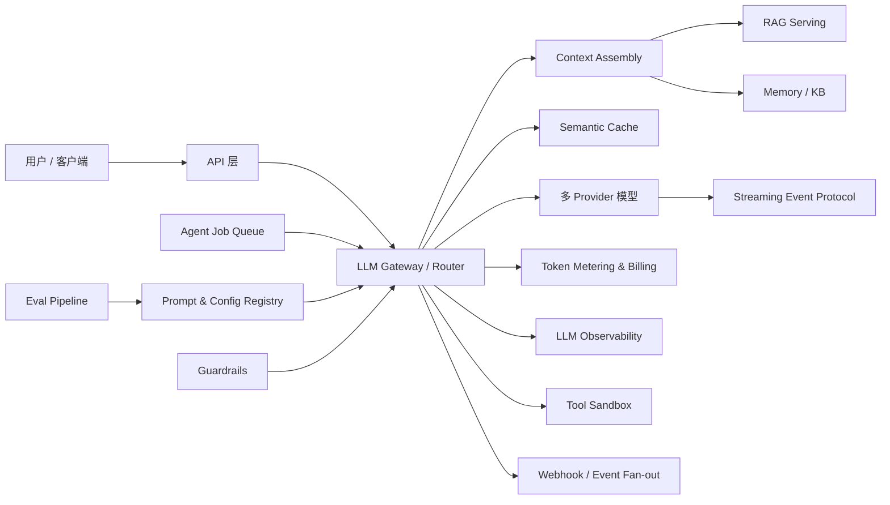

# Agent 后端基础设施：15 个知识点整理

> **视频**：[agent 15个小知识点（比较基础）](https://www.bilibili.com/video/BV11yhN6iE37/)  
> **UP 主**：假如今天可以躺平｜**时长**：25:20｜**整理日期**：2026-08-25  
> **证据说明**：视频部分来自 B 站字幕（OpenCLI / agent-reach）；扩展部分优先引用厂商官方文档、标准和一手项目文档。视频中的 `letter L M`、`Port key`、`script`、`SICE` 等明显近音词，按上下文校正为 LiteLLM、Portkey、Stripe、SSE 等。

## 一句话总论

做一个能承载真实流量的 AI/Agent 产品，难点不只是“调用一次模型 API”，而是要把**模型依赖、成本、流式协议、知识、异步执行、安全、版本、评测和可观测性**做成可治理的后端平台。一个实用判断是：**把每次模型调用视为生产依赖，把每个 Agent 任务视为可恢复的分布式工作流，把每个输出视为需要评测和追踪的概率性产物。**

## 总体架构



## 15 个知识点

### 1. LLM Gateway / Proxy（模型网关与代理层）

**视频要点（约 1:10–3:06）**：统一接入 OpenAI、Anthropic 等 Provider，屏蔽协议差异；集中处理超时、限流、重试、退避、故障转移、虚拟 Key、预算和跨供应商成本追踪。Agent 每一轮“思考 → 调工具 → 再思考”都经过网关，多 Agent 并发时只有网关能做全局治理。

**工程补充**：网关不应只是 HTTP 转发器，而应提供：

- **能力归一化**：内部统一 `generate / stream / tool_call / embedding` 事件模型，同时保留 Provider 能力探测，避免把“不支持结构化输出”伪装成支持。
- **策略执行**：按租户、项目、用户、任务类型和模型设置 QPS、并发数、token 配额、每日预算。
- **可靠性**：连接超时、读取超时、重试次数、指数退避 + 抖动、熔断、健康检查、幂等请求 ID。
- **路由**：按质量、延迟、价格、区域、合规和当前容量选择模型；失败时只在“安全可重试”的阶段切换。
- **密钥隔离**：业务代码只拿到虚拟 Key，真实 Provider Key 由网关保管并轮换。

**常见实现**：LiteLLM Proxy、Portkey Gateway，以及自建 Envoy/Nginx + LLM policy service。LiteLLM 的 Proxy 文档可作为多 Provider、预算、日志和 Key 管理的参考：[LiteLLM Proxy](https://docs.litellm.ai/docs/proxy/quick_start)。

**注意**：不要把所有错误都重试。已经产生副作用的工具调用必须使用幂等键或进入人工确认；模型生成失败可以重试，支付/写库类工具调用则不能盲重试。

### 2. Token Metering & Billing System（Token 计量与计费）

**视频要点（约 3:10–5:20）**：精确统计每个用户/租户的输入、输出 token，把用量变成账单；要处理流式生成中途取消、Agent 一次任务调用十几次模型、工具和检索结果造成的隐形成本。没有任务级计量，单位经济模型就是一笔糊涂账。

**建议的数据模型**：

```text
usage_event(id, task_id, tenant_id, user_id, provider, model,
            input_tokens, output_tokens, cached_tokens,
            tool_tokens, embedding_tokens, latency_ms,
            status, idempotency_key, occurred_at)
```

- 以**不可变 usage event** 为事实源，再异步聚合到租户账本；不要直接修改历史账单。
- 同时记录 `requested / reserved / actual / billable`：请求取消时，Provider 返回的 usage 优先；没有 usage 时按保守规则估算并标记为 estimated。
- 价格表必须版本化：模型价格、缓存 token 价格、输入/输出价格和生效时间都要进入账单快照。
- Agent 任务要建立父子层级：`task_cost = Σ model_call + embedding + rerank + tool_runtime + storage`，支持按任务、工作流、用户、租户分析。
- 账单聚合应可重放；Stripe 的 usage-based billing 文档可参考“meter event → 聚合 → invoice”的模式：[Stripe usage-based billing](https://docs.stripe.com/billing/subscriptions/usage-based)。

**核心指标**：每任务成本、每成功任务成本、毛利、预算拒绝率、估算用量占比、缓存节省金额、不同模型的质量/成本曲线。

### 3. Streaming Response Infrastructure（流式响应基础设施）

**视频要点（约 5:20–7:06）**：用 SSE 或 WebSocket 逐步返回 token；要处理背压、断线重连、续传、长任务挂起恢复。用户感知的“快”主要是 TTFT（Time to First Token），不是完整回答耗时。Agent 应把状态、工具调用、工具结果和阶段进度作为事件流，而不是 UI 补丁。

**建议把流式输出设计成协议**：

```text
run.started → reasoning.delta → tool.call → tool.result
→ message.delta → run.usage → run.completed / run.failed
```

- 每个事件带 `run_id`、单调递增 `sequence`、`event_id`、时间戳和可选 `parent_id`。
- SSE 适合服务器单向推送，使用 `id` + `Last-Event-ID` 做恢复；WebSocket 适合双向控制和人工审批，但连接状态管理更复杂。参见 [MDN SSE](https://developer.mozilla.org/en-US/docs/Web/API/Server-sent_events/Using_server-sent_events)。
- 事件必须可重放；客户端重复收到事件时按 `event_id` 幂等处理。
- 长任务不要把业务状态只放在内存连接里；连接断开后，客户端应通过 `run_id` 查询快照或重新订阅。
- 背压策略要明确：丢弃可重建的 delta，不能丢失工具结果、最终状态和计费事件。

### 4. RAG Serving Pipeline（RAG 服务流水线）

**视频要点（约 7:06–8:39）**：完整链路是摄取文档 → 切分 → 向量化 → 建索引 → 在线检索；关键不是某个向量库，而是增量更新、metadata filter、多租户隔离和查询改写。Agent 不应每轮对话无脑检索，而要结合上下文判断是否检索、检索几次。

**推荐拆成离线与在线两条链**：

1. **离线**：connector → 解析/OCR → 清洗 → chunk → embedding → metadata → index；文档以版本或内容 hash 去重，更新采用 upsert/delete，而非全量重建。
2. **在线**：query rewrite → tenant/ACL filter → hybrid retrieval → rerank → context packing → citation → answer。

必须把 `document_id / chunk_id / source_version / ACL / created_at / expires_at` 作为一等元数据。Pinecone 的多租户资料展示了 namespace 隔离和按租户查询的设计：[Pinecone multitenancy](https://docs.pinecone.io/guides/indexes/implement-multitenancy)。

**质量指标**：召回 Recall@K、MRR/NDCG、上下文精确率、引用正确率、过期文档命中率、索引延迟、删除传播延迟、每次检索 token 成本。

### 5. Semantic Cache Layer（语义缓存层）

**视频要点（约 8:39–10:06）**：用 embedding 相似度判断问题是否与历史问题语义相近，命中则直接返回，降低成本和延迟；但必须防止过期答案驱动 Agent 做错决策。缓存命中率可成为产品控制指标。

**缓存键不能只有 query**，至少应包含：`tenant_id、model、system_prompt_version、tools_hash、knowledge_base_version、locale、safety_policy_version`。否则同一个问题在不同租户、不同知识库或不同模型下会发生串答。

- 对普通 FAQ 可使用 embedding 相似度 + metadata filter + TTL。
- 对 Agent 子任务，应只缓存无副作用、可验证的纯函数步骤；工具写操作和实时数据查询默认不缓存。
- 设置相似度阈值、最大 staleness、负缓存和人工失效机制；命中后仍可做轻量 freshness check。
- 另外区分**语义结果缓存**与**Prompt prefix/KV cache**。Anthropic 和 OpenAI 的 prompt caching 主要复用稳定前缀，并不等价于“问题答案缓存”： [Anthropic prompt caching](https://docs.anthropic.com/en/docs/build-with-claude/prompt-caching)、[OpenAI prompt caching](https://platform.openai.com/docs/guides/prompt-caching)。

### 6. Async Agent Job Queue（异步 Agent 任务队列）

**视频要点（约 10:06–11:43）**：长任务需要队列、检查点、重试和死信队列；不能依赖一个一直挂着的 HTTP 请求。每一步工具调用结果都应持久化，失败后从断点继续，用户通过状态查询或事件订阅获取进度。

**任务状态机示例**：`queued → running → waiting_tool / awaiting_approval → retrying → succeeded / failed / canceled`。

- 每个 step 记录输入 hash、输出引用、重试次数、超时和 checkpoint；工作流重放必须可预测。
- 重试采用指数退避 + jitter，设置最大尝试次数和 DLQ；外部工具使用幂等键。
- 取消是协作式的：更新 cancel flag，worker 在 step 边界检查；不能粗暴杀掉正在写副作用的进程。
- Temporal 提供 durable execution、定时器、重试和事件历史，可作为持久化工作流参考：[Temporal Workflow Execution](https://docs.temporal.io/workflow-execution)。队列较简单时也可以用 Cloudflare Queues、SQS、Kafka 等。

### 7. Tool Execution Sandbox（工具执行沙箱）

**视频要点（约 11:43–13:22）**：模型输出是不可信的，代码、Shell、SQL、浏览器和第三方 API 必须在隔离环境中执行。网络出口、文件访问、CPU/内存/时长都要最小权限；否则相当于把生产 root 权限交给黑盒。

**纵深防御**：

1. 进程/容器/微虚拟机隔离；非 root、只读文件系统、临时工作目录。
2. 默认无网络；按域名、方法、端口和请求体做 egress allowlist。
3. CPU、内存、磁盘、进程数、执行时长和并发配额。
4. 工具 schema 校验参数，敏感操作采用审批或二次确认。
5. 密钥不直接暴露给模型；通过短期凭证和受控 broker 访问外部服务。
6. 记录完整审计日志，并对输出做 DLP/敏感信息扫描。

Docker 安全模型可作容器边界的基础参考：[Docker Engine security](https://docs.docker.com/engine/security/)。注意：普通容器不是完美安全边界；面对恶意代码应考虑 gVisor、Firecracker 或专用沙箱服务。

### 8. Multi-Tenant Knowledge Base（多租户知识库）

**视频要点（约 13:22–15:20）**：每个租户至少要有 namespace 或行级隔离，并在检索层强制执行 metadata/ACL filter。不能指望在 Prompt 里写“注意隐私”来防止 A 公司读到 B 公司文档。

**隔离层次**：租户 ID → 数据库 Row-Level Security / namespace → 文档 ACL → 检索过滤 → context assembly → 缓存键 → 日志脱敏。任何一层漏掉 tenant scope 都可能造成越权。

- 高风险租户可使用独立索引、独立加密密钥甚至独立数据库。
- 删除、导出、备份和日志也必须带租户边界；测试中加入“跨租户 canary”查询。
- 在向量库查询前注入不可绕过的租户过滤器，禁止业务调用方任意覆盖。
- 对“共享公共文档”单独建公共 namespace，显式合并，而不是把所有数据放在一个默认空间。

### 9. Prompt & Config Versioning Service（Prompt 与配置版本服务）

**视频要点（约 15:20–16:53）**：Prompt、模型选择、参数、工具描述和路由规则共同决定 Agent 行为，应像管理代码一样版本化；支持回滚、灰度和 A/B 路由。

**版本对象建议**：`prompt_version`、`model_policy_version`、`tool_schema_version`、`retrieval_policy_version`、`guardrail_policy_version`，每次运行写入完整版本 manifest。

- 发布流程：draft → review → eval gate → canary → full rollout → rollback。
- 配置不可变，使用别名指向当前生产版本；回滚只切换别名，不覆盖历史。
- 灰度按租户、用户 hash、区域或流量比例稳定分桶。
- 对 Prompt 做 secret scanning、变量 schema 校验、长度预算和 diff review。
- LangSmith 将 Prompt、评测、追踪和部署串起来，可参考其 Evaluation 文档：[LangSmith Evaluation](https://docs.smith.langchain.com/evaluation)。

### 10. Eval Pipeline Backend（评测流水线后端）

**视频要点（约 16:53–18:25）**：每次部署前自动跑黄金数据集，记录历史分数；Agent 要评测任务完成、工具调用准确性和多步骤决策，不能上线后等客户投诉。

**评测分层**：

- 单元级：Prompt 模板、JSON schema、工具参数解析。
- 组件级：检索 Recall@K、rerank、guardrail 命中率。
- 轨迹级：工具选择、参数正确率、是否遵守审批、最大步数、恢复能力。
- 任务级：任务成功率、事实正确率、引用覆盖率、人工偏好、成本和延迟。
- 生产回放：从脱敏 trace 采样，形成回归集；对失败样本自动聚类。

评测结果应关联 `code_sha、prompt_version、model、kb_version、tool_version`，并设置质量、成本、延迟的发布门槛。单一 LLM-as-a-judge 不够可靠，重要指标要配规则校验、执行结果和人工抽检。

### 11. LLM Observability（LLM 可观测性）

**视频要点（约 18:25–19:56）**：追踪 Prompt、输出、token、延迟和成本；Agent 是多跳调用链，必须看到模型当时看到了什么、在哪一步开始跑偏，而不是只看某一次 API 日志。

**Trace 结构**：一个 `agent.run` 为 root span，子 span 包括 `llm.generate`、`retrieval`、`rerank`、`tool.call`、`sandbox.exec`、`guardrail.check`、`webhook.publish`。OpenTelemetry 的 traces 概念可作为通用语义参考：[OpenTelemetry traces](https://opentelemetry.io/docs/concepts/signals/traces/)。

**必备字段**：trace/run/task ID、tenant、prompt/model/config 版本、输入输出 token、cached token、TTFT/总延迟、重试、工具参数和结果摘要、检索文档 ID、错误分类、估算成本。生产日志应默认脱敏、采样，并限制原始 Prompt/输出的保留期限。

### 12. Webhook & Event Fan-out（Webhook 与事件分发）

**视频要点（约 19:56–21:19）**：把 Agent 完成、工具调用、批处理、微调和长任务事件签名后可靠推送给客户系统；需要重试、幂等和失败告警，用事件驱动代替各系统轮询。

- 事件 envelope：`event_id、type、created_at、tenant_id、run_id、payload、schema_version`。
- 签名采用 HMAC/非对称签名，带时间戳防重放；接收方按 `event_id` 幂等。
- 指数退避、最大重试窗口、DLQ、回放工具和 endpoint 健康度。
- Fan-out 先写 durable outbox，再由 dispatcher 投递，避免数据库提交成功但 webhook 丢失。
- 事件 schema 需要向后兼容，敏感 payload 使用引用而不是直接嵌入。

### 13. Context Assembly Service（上下文组装服务）

**视频要点（约 21:19–22:39）**：把记忆、文档、工具描述和历史装入有 token 预算的上下文；必须按优先级裁剪。上下文太少会缺信息，太多会增加成本、噪声，甚至把关键指令挤出窗口。

可将上下文视为一个带预算的背包问题：

```text
budget = model_context_limit - reserved_output - safety_margin
priority = instruction > current_user_goal > tool_result > fresh_retrieval
           > recent_history > long_term_memory > metadata
```

- 每个片段带 `source、priority、freshness、token_count、confidence、sensitivity`。
- 先硬约束（系统指令、租户 ACL、工具 schema），再按相关性/新鲜度/成本排序。
- 对历史做摘要或压缩，但保留可回溯引用；对工具结果保留结构化结果和短摘要。
- 稳定前缀放在前面并配合 Prompt caching；动态内容放后面，减少缓存失效。
- 组装结果要可观测：记录“入选了什么、裁掉了什么、为什么”。

### 14. Guardrails Middleware（安全/防护中间件）

**视频要点（约 22:39–24:00）**：输入输出两端过滤、敏感信息脱敏、工具注入检测和参数校验应是独立中间件，而不是在 Prompt 里补一句安全提示。Agent 会读取网页、文档和文件，这些外部内容可能携带 Prompt injection。

**建议三道闸门**：

1. **输入**：越权意图、恶意 Prompt、PII、内容安全分类；必要时拒绝或脱敏。
2. **工具边界**：schema/类型/范围校验，权限检查，危险操作审批，网络和文件策略。
3. **输出**：敏感信息/DLP、引用要求、格式/schema、越权数据泄露和策略违规检测。

OWASP 将 Prompt Injection 列为 LLM 应用的重要风险：[OWASP LLM01](https://genai.owasp.org/llmrisk/llm01-prompt-injection/)。Guardrail 失败时要有明确策略：block、redact、ask-human、safe-fallback，而不是静默继续。

### 15. Model Fallback & Routing Engine（模型回退与路由引擎）

**视频要点（约 24:00–25:20）**：按任务复杂度选择便宜/昂贵模型；用健康检查发现 Provider 限流或宕机并切换备用模型。规划用强推理模型，抽取/分类用快而便宜的模型，低风险总结可用小模型；目标是质量可接受时把成本压到最低。

**路由决策维度**：任务类型、质量等级、上下文长度、工具能力、数据合规区域、实时价格、P95 延迟、当前错误率、租户预算和模型健康度。

- 用 capability matrix 记录每个模型是否支持 vision、tools、JSON schema、长上下文、streaming、reasoning 等。
- Fallback 分为 provider fallback、model fallback、策略降级（减少工具/缩短上下文）；切换后要在 trace 中记录原因。
- 多步 Agent 中途切换模型可能导致风格、工具决策或推理状态不一致；应在安全的 step 边界切换，并重新校验输出 schema。
- 路由不是只看价格：使用质量-成本-延迟的 Pareto frontier，并用离线评测和线上 shadow traffic 校准。

## 贯穿全系统的 8 条原则

1. **统一内部事件模型**：Provider 的不同 API 适配在边界层，业务消费稳定的 `text/tool/status/usage` 事件。
2. **每个运行都有 ID 和版本清单**：`tenant_id + run_id + trace_id + config_manifest` 是审计、计费、评测和回放的连接点。
3. **所有长任务可恢复**：状态写入 durable store，连接只是观察窗口。
4. **所有副作用可幂等**：工具、账单、webhook、任务重试都需要幂等键。
5. **安全边界早于模型**：权限、沙箱和 Guardrail 不能由 Prompt 自觉保证。
6. **上下文是有限资源**：token 预算、缓存、检索和历史压缩必须统一编排。
7. **质量、成本、延迟同时优化**：只追求回答质量，可能得到不可负担或不可用的系统。
8. **从生产 trace 反哺评测**：线上失败样本、人工反馈和成本异常应进入回归集。

## 推荐的最小落地顺序

### Phase 1：单租户 MVP

- 一个统一 Gateway；
- 基础 token usage 记录；
- SSE 流式协议；
- RAG 的增量索引和 metadata；
- 基础 trace 与错误日志；
- 工具白名单和超时。

### Phase 2：生产可靠性

- Redis/向量语义缓存；
- durable job queue + checkpoint + DLQ；
- webhook outbox/fan-out；
- Prompt/config registry；
- 基准集回归评测；
- 多 Provider fallback。

### Phase 3：企业级治理

- 强制多租户隔离与 RLS/namespace；
- 微虚拟机或专用沙箱；
- 预算、账单、成本分摊和配额；
- Guardrails、DLP、审批流；
- 生产 trace 回放、自动评测和灰度发布。

## 快速检查清单

- [ ] 业务代码是否直接散落着多个 Provider SDK 调用？
- [ ] 能否回答“这个 Agent 任务总共花了多少钱”？
- [ ] 客户端断线后能否恢复事件和任务进度？
- [ ] RAG 更新是否增量、可删除、可追踪版本？
- [ ] 缓存键是否包含租户、Prompt、模型和知识库版本？
- [ ] Agent 失败是否能从 checkpoint 继续，而不是从头重跑？
- [ ] 工具是否默认无网络、非 root、有限资源？
- [ ] 是否有自动化跨租户检索测试？
- [ ] 每次上线是否记录 Prompt/模型/工具/知识库版本？
- [ ] 是否有任务完成率、工具准确率和回归评测门禁？
- [ ] Trace 能否看到模型输入、检索证据和每一步工具结果？
- [ ] Webhook 是否签名、重试、幂等、可回放？
- [ ] 上下文裁剪是否可解释？
- [ ] 输入、工具、输出是否都有 Guardrail？
- [ ] Provider 故障时是否能按能力切换，而不是只换一个字符串？

## 相关官方资料

- [LiteLLM Proxy](https://docs.litellm.ai/docs/proxy/quick_start)
- [MDN：Server-sent events](https://developer.mozilla.org/en-US/docs/Web/API/Server-sent_events/Using_server-sent_events)
- [Pinecone：Multi-tenancy](https://docs.pinecone.io/guides/indexes/implement-multitenancy)
- [Temporal：Workflow Execution](https://docs.temporal.io/workflow-execution)
- [Docker Engine Security](https://docs.docker.com/engine/security/)
- [Stripe：Usage-based billing](https://docs.stripe.com/billing/subscriptions/usage-based)
- [OpenTelemetry：Traces](https://opentelemetry.io/docs/concepts/signals/traces/)
- [Cloudflare Queues](https://developers.cloudflare.com/queues/)
- [Anthropic：Prompt caching](https://docs.anthropic.com/en/docs/build-with-claude/prompt-caching)
- [OpenAI：Prompt caching](https://platform.openai.com/docs/guides/prompt-caching)
- [OpenAI Agents SDK：Guardrails](https://openai.github.io/openai-agents-python/guardrails/)
- [OWASP GenAI：Prompt Injection](https://genai.owasp.org/llmrisk/llm01-prompt-injection/)

## 转写校正说明

视频字幕存在大量中文近音词。本笔记将 `LM 网关` 统一为 `LLM Gateway`，`A键` 统一为 `Agent`，`ROG/RANG` 统一为 `RAG`，`trunk` 统一为 `chunk`，`manta data` 统一为 `metadata`，`letter l m policy` 统一为 `LiteLLM Proxy`，`Port key a i gateway` 统一为 `Portkey AI Gateway`，`SICE` 统一为 `SSE`，`long smith` 统一为 `LangSmith`，`web box` 统一为 `webhook`。这些修正用于可读性，不代表视频逐字稿本身使用了标准术语。
