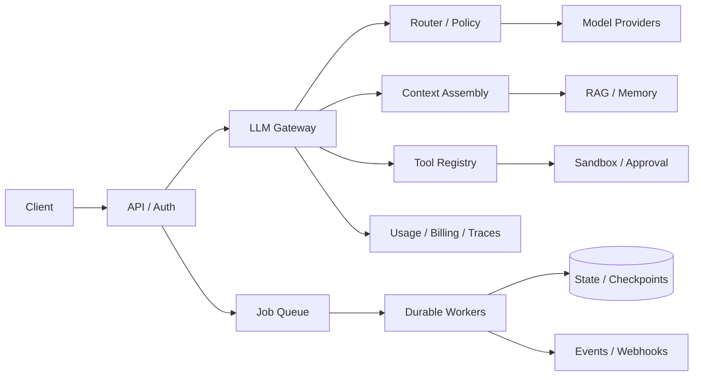

# Agent 开发对应的系统设计知识

> **视频**：[agent开发对应的系统设计知识](https://www.bilibili.com/video/BV1SgMz67ESb/)  
> **UP 主**：假如今天可以躺平｜**时长**：40:58｜**整理日期**：2026-08-25  
> **配套仓库**：[donnemartin/system-design-primer](https://github.com/donnemartin/system-design-primer)  
> **证据说明**：视频部分来自 B 站字幕（OpenCLI / agent-reach）；仓库部分根据 GitHub 当前 README、目录和 API 元数据整理。字幕中的 `CIP/CCAP`、`ROG`、`PERO catch` 等近音词，按上下文校正为 CAP、RAG、prefix/KV cache。

## 一句话总论

Agent 本质上是一个**带状态、不可完全预测、按 token 计费、包含外部副作用的分布式系统**。因此，传统系统设计中的容量估算、延迟与吞吐、一致性、负载均衡、缓存、异步、背压、幂等、API 设计和安全，并没有因为引入 LLM 而失效；它们只是被重新映射到模型调用、上下文、工具和 Agent loop 上。

> **最重要的迁移**：不要从“写一个 Prompt”开始，而要先定义任务、约束、预算、失败策略和可观测指标，再选择 Agent loop、模型、工具和存储方案。

## 配套仓库是什么

截至 2026-08-25，通过 GitHub API 读取到的仓库状态：

| 项目 | 当前信息 |
| --- | --- |
| 仓库 | `donnemartin/system-design-primer` |
| 定位 | 学习大规模系统设计、准备系统设计面试的开源知识库 |
| Stars | 约 365,954 |
| Forks | 约 58,045 |
| 默认分支 | `master` |
| 最近更新时间 | 2026-08-25 |
| 主要目录 | `solutions/system_design`、`solutions/object_oriented_design`、`resources/flash_cards` |
| 内容形态 | README 主题索引、设计题解答、OOD 题、Anki 卡片、真实架构和工程博客链接 |
| License | GitHub API 标记为 `Other`，使用前应阅读仓库 `LICENSE.txt` |

仓库 README 的核心组织方式是：

1. **概念字典**：性能、扩展性、CAP、负载均衡、数据库、缓存、异步、通信和安全。
2. **系统设计方法论**：如何澄清问题、估算规模、提出高层方案、深入核心组件、分析瓶颈与权衡。
3. **完整设计题**：网页爬虫、Pastebin/短链接、Twitter、Mint、KV 存储、Amazon 销量排行、百万用户 AWS 系统等。
4. **辅助材料**：Anki 闪卡、真实架构、公司工程博客和面向对象设计题。

## 视频给出的 Agent 映射

| System Design Primer 概念 | Agent 中的对应物 | 关键问题 |
| --- | --- | --- |
| 性能 vs 可扩展性 | 单用户响应速度 vs 并发 Agent 数量 | 上下文越大是否拖垮并发？ |
| 延迟 vs 吞吐量 | 交互式对话 vs 批处理/代码迁移 | 该优化 TTFT 还是单位时间任务数？ |
| CAP / 一致性 | 主 Agent、子 Agent、共享记忆 | 何时接受最终一致，何时必须串行？ |
| CDN Push/Pull | 上下文预加载 vs 按需检索 | 预加载的成本是否值得？ |
| L4/L7 负载均衡 | 连接转发 vs 按任务选择模型 | 路由判断本身是否抵消收益？ |
| 水平扩展 | 无状态 Agent Worker + 外置状态 | 进程重启后能否恢复？ |
| 微服务 | Multi-Agent / 工具服务拆分 | 拆分带来的是独立扩展还是复杂度？ |
| 服务发现 | MCP/工具注册与健康检查 | Agent 能否发现、理解并正确调用工具？ |
| 数据库索引 | 向量索引 + metadata filter | 是否能按租户、时间、来源过滤？ |
| 反范式化 | 预拼装上下文、摘要和记忆 | 读取更快是否值得接受数据陈旧？ |
| 缓存 | 请求缓存、语义缓存、Prompt/KV cache | 缓存失效和租户隔离如何处理？ |
| 消息/任务队列 | 长时 Agent、深度研究、代码迁移 | 如何检查点、重试、取消和恢复？ |
| 背压 | 模型限流、队列过载、并发控制 | 队列满时拒绝还是无限等待？ |
| 幂等 | 工具调用、扣款、发消息、Webhook | 重试两次是否产生两次副作用？ |
| RPC/REST | 工具 schema、MCP API、错误信息 | API 文档的读者变成了模型 |
| 安全 | 最小权限、Prompt Injection、沙箱 | 不可信输出能否直接触发副作用？ |

## 一、先用四步法设计 Agent

视频认为，仓库最值得迁移到 Agent 开发的部分不是某个组件，而是**系统设计四步法**。

### 第一步：明确场景、约束和假设

先回答：

- Agent 服务什么任务？问答、检索、代码修改、数据清洗还是自动执行？
- 用户是人在屏幕前等待，还是提交任务后稍后查看结果？
- 每天请求量、峰值并发、平均上下文、最大上下文和输出长度是多少？
- 每个任务最多调用多少次模型、工具和子 Agent？
- TTFT、完整响应、任务完成时间分别有什么 SLA？
- 哪些工具必须可用，哪些工具可以降级或人工审批？
- 哪些数据可以最终一致，哪些操作必须强一致？
- 任务失败、Provider 限流、工具超时、用户取消时如何处理？

直接写 Prompt、跑 Demo、效果不好再改 Prompt，会跳过系统真正的边界定义。对于 Agent，Prompt 只是系统设计中的一个组件。

### 第二步：做容量估算

视频用客服 Agent 举例：日活 1 万人、每人 8 轮、每轮平均上下文 15,000 token，则粗略输入规模为：

```text
10,000 用户 × 8 轮 × 15,000 token ≈ 1.2B token / 天
```

这个数字会直接影响模型选择、缓存、上下文压缩、异步化和预算，而不是等系统上线后再观察账单。

建议至少估算：

```text
daily_tokens = DAU × sessions_per_user × turns_per_session
               × avg_input_tokens + output_tokens

peak_rps = daily_requests × peak_factor / active_seconds
concurrency ≈ peak_rps × p95_latency_seconds
provider_cost = input_tokens × input_price
              + output_tokens × output_price
              + tool / embedding / rerank cost
```

Agent 还要额外估算 `steps_per_task`、并行分支数、最大深度、工具耗时和 checkpoint 存储量。最容易低估的是：多轮历史会累加上下文，单个用户任务可能隐藏十几次模型调用。

### 第三步：设计高层架构并深入核心组件

先画出用户入口、Gateway、任务编排、模型、RAG、工具、状态库、队列、缓存、计量和可观测性，再针对瓶颈深入。不要一开始就争论“选哪个向量数据库”，先确认真正的瓶颈是模型、工具、串行深度、存储还是网络往返。

### 第四步：找瓶颈、做容量和权衡

常见权衡包括：

- 质量 vs 成本：更大模型、更多上下文、更多检索会增加费用。
- 延迟 vs 吞吐：交互式 Agent 追求 TTFT，批处理 Agent 追求并行吞吐。
- 一致性 vs 可用性：共享记忆是最终一致，扣款和写入则可能必须强一致。
- 预加载 vs 按需：上下文预拼装降低首轮检索，但可能浪费 token。
- 拆分 vs 复杂度：Multi-Agent、微服务和更多队列会增加调试面。

## 二、性能与可扩展性

### 性能不是可扩展性

- **性能问题**：单个用户、单个任务就慢。
- **可扩展性问题**：单用户很快，但并发用户增加后延迟、错误率或成本失控。

Agent 中典型的冲突是：把更多文档和历史塞入上下文，单次回答可能更完整，却增加 token、TTFT、内存和并发成本。优化一个请求不等于系统具备可扩展性。

### 延迟与吞吐量要按工作负载选

| 工作负载 | 优先级 | 典型架构 |
| --- | --- | --- |
| 交互式聊天 | TTFT、P95 延迟、流式体验 | SSE/WebSocket、流式模型、上下文缓存、少量并行 |
| 深度研究 | 可恢复、阶段进度、总完成时间 | Job Queue、checkpoint、事件流、长任务 worker |
| 数据清洗/代码迁移 | 吞吐、单位成本、失败重试 | 批量请求、并行 worker、便宜模型、DLQ |

不要用“用户在线等待”的对话架构去跑无人值守批处理，也不要让批处理任务一直占用交互式 HTTP 连接。

### Agent 性能优化的第一顺序

视频的判断很实用：AI 系统中，绝大多数高收益优化不是把 Python 代码从 200 ms 优化到 20 ms，而是：

1. 减少模型调用次数；
2. 减少串行 Agent step；
3. 合并可以合并的请求；
4. 并行执行无依赖的工具；
5. 缓存稳定的 Prompt 前缀、检索结果和纯函数子任务；
6. 用规则或小模型过滤简单任务，再升级到大模型。

## 三、CAP、一致性与 Agent 记忆

网络分区是现实约束，CAP 不是“三选二”的部署开关，而是出现分区时在一致性和可用性之间做取舍。

### 三种一致性

- **弱一致性**：写入后，读取可能读到，也可能读不到；适合可丢失的进度或非关键状态。
- **最终一致性**：经过一段时间后最终可读；适合异步索引、分析报表和部分长期记忆。
- **强一致性**：写入成功后立刻读到；适合扣款、权限、库存和不可重复的副作用。

### 映射到 Multi-Agent

主 Agent 同时启动三个子 Agent，它们向共享记忆写入时，不能假设 A 写入后 B 立即可见。否则 B 可能因为读到空上下文而编造内容，这类“幻觉”其实是系统状态不一致导致的。

从低成本到高成本的处理方式：

1. 在 Prompt/协议中明确“信息可能不完整”，接受最终一致。
2. 增加 barrier：等待所有子任务完成后，再组装下一步上下文。
3. 对强一致业务使用串行、事务、锁或版本检查，例如扣款、发消息、权限变更。

### 故障切换也会带来一致性问题

- Active-passive：主 Provider 故障时切到备用 Provider，简单但切换瞬间可能丢失飞行中的请求。
- Active-active：多个 Provider 同时承载流量，可用性更高，但输出风格、能力和账单聚合更复杂。

Fallback 必须记录原因、任务 step、模型版本和是否发生状态迁移，不能只把模型名替换掉。

## 四、CDN、上下文和检索策略

视频把 CDN 的 Push/Pull 类比为 Agent 上下文的预加载和按需检索：

- **Push/预加载**：提前把用户资料、历史摘要、常用文档放入上下文；首轮快，但可能浪费 token。
- **Pull/按需检索**：模型需要时才查 RAG、记忆或工具；成本可控，但首轮可能更慢。

生产系统通常是混合策略：稳定、高频、低敏的上下文预加载；长尾内容按需检索；动态数据必须做 freshness check。

RAG 不是一个“向量库查询”函数，而是完整服务链：

```text
文档摄取 → 解析/OCR → Chunk → Embedding → 索引
      → 查询改写 → ACL/租户过滤 → Hybrid Retrieval
      → Rerank → Context Packing → 生成与引用
```

索引必须保存原文和 metadata，如租户、来源、时间、版本、权限和过期时间。只有 embedding 没有原数据时，按用户、时间或来源过滤会变得困难，噪声也会交给模型承担。

## 五、负载均衡、网关与水平扩展

### L4 与 L7

- **L4**：按 IP、端口和连接分发，不理解请求内容，快而简单。
- **L7**：理解 HTTP/API 内容，可按租户、路径、模型能力、任务复杂度路由，灵活但判断成本更高。

模型路由本质上是更高层的 L7 负载均衡：简单问题走小模型，复杂推理走大模型。路由器本身应该尽量轻量，优先使用规则、长度、关键词或小分类模型；不要为了决定是否调用大模型，先调用一次大模型。

### Gateway 同时扮演两种角色

反向代理提供统一入口、TLS、压缩、基础缓存和转发；负载均衡器把请求分配到多台后端。LLM Gateway 往往同时做这两件事，还额外负责 Provider 适配、预算、重试、fallback 和审计。

### 状态必须外置

要水平扩展 Agent Worker：

- 进程内只保留临时计算状态；
- 会话、任务、checkpoint、记忆和计费写入持久化存储；
- 请求可以被任意 worker 接收；
- 进程重启、扩容或迁移后能从 `run_id/checkpoint` 恢复。

把上下文放在单个 Agent 进程的内存中，是从 Demo 走向生产最常见的第一道坎。

## 六、微服务、Multi-Agent 与服务发现

微服务带来独立部署、独立扩容和职责边界，但也带来网络、版本、监控、发布和故障排查复杂度。视频的建议是：**能用一个 Agent 解决的问题，不要为了“高级”强行拆成 Multi-Agent。**

适合拆分的信号包括：

- 子任务需要不同模型、权限或资源配额；
- 组件需要独立扩容或独立发布；
- 任务边界稳定，输入输出可以严格定义；
- 单体 Agent 已经无法维护或测试。

Agent 间接口比微服务接口更危险：微服务通常使用严格 JSON schema，字段缺失会报错；Agent 间传递的是自然语言上下文，遗漏关键条件可能不会报错，而是让下游自信地执行错误决策。

因此 Multi-Agent 需要：

- typed task envelope，而不是只传自然语言；
- 输入/输出 schema 校验；
- 任务、权限、预算和 deadline 显式传递；
- 每个子 Agent 的能力、工具和失败协议注册化；
- trace 能看到跨 Agent 的父子关系。

服务发现映射到 MCP/工具注册中心：工具要有名称、描述、schema、版本、权限、健康状态和 owner；Agent 只能发现和调用当前租户允许的工具。

## 七、数据库、反范式化与存储选型

### 反范式化 = 预拼装上下文

数据库反范式化通过冗余换查询速度，减少昂贵 Join。Agent 中对应的是提前把用户资料、订单摘要、商品详情、历史记忆拼装成可直接读取的上下文。

优点是减少串行工具调用和网络往返；代价是数据可能陈旧，需要写入时更新、定期刷新、版本校验或失效事件。

### 不同数据用不同存储

| 数据类型 | 典型存储 | 适合查询 |
| --- | --- | --- |
| 事务、权限、账单、原始 metadata | RDBMS | 结构化查询、事务、关系和约束 |
| 会话状态、幂等键、限流计数 | KV/Redis | 低延迟按键读写、TTL |
| 文档和原始内容 | Document/Object Store | 非结构化内容、版本和归档 |
| 语义检索 | Vector DB / pgvector | Embedding 相似度 + metadata filter |
| 关系密集知识 | Graph DB | 多跳关系和实体关联 |

生产 Agent 通常是混合存储，而不是寻找一个“万能数据库”。

### 索引要建在真实查询上

向量索引只是语义召回的一部分。真实系统还要针对租户、时间、来源、权限、状态和版本建立过滤能力；否则会把本可由数据库过滤解决的噪声交给模型。

## 八、缓存：四层、四种写入策略和失效

### Agent 的缓存层次

1. 客户端/浏览器缓存：渲染状态、已完成结果和静态资源。
2. Gateway 精确缓存：完全相同请求、模型和配置版本。
3. 语义缓存：Embedding 相近的问题和可复用答案/子任务。
4. 模型 Prompt/KV cache：稳定前缀的 token 计算复用。

缓存键必须包含租户、模型、Prompt 版本、工具版本、知识库版本和安全策略版本，避免跨租户或跨版本串答。

### 四种缓存更新方式

| 模式 | Agent 映射 | 优点 | 风险 |
| --- | --- | --- | --- |
| Cache-aside | 先查缓存，未命中再查 RAG/DB 并回填 | 简单、按需 | 首次慢、可能陈旧、冷启动 |
| Write-through | 写记忆时同步写缓存和持久层 | 读取一致 | 写入延迟高 |
| Write-behind | 先写缓存，异步落盘 | 写入快 | 缓存故障可能丢记忆 |
| Refresh-ahead | 过期前主动刷新上下文 | 降低命中延迟 | 预测错误会浪费成本 |

用户通常比起读取延迟，更能接受保存/更新稍慢；因此关键记忆可以优先采用可确认的 write-through 或 durable outbox。

### 记忆失效不能只靠固定 TTL

不同记忆有不同衰减速度：姓名可能长期有效，工作公司可能数年变化，使用框架可能几个月变化，当前 Bug 可能几小时就失效。可按记忆类型定义 TTL、版本和事件触发失效，并用用户显式纠正覆盖旧值。

Prompt prefix cache 还要求稳定前缀逐字相同。把当前时间戳、随机 ID 或每轮变化的内容放进 system prompt，会让命中率接近零；稳定指令应固定在前缀，动态上下文放在后面。

## 九、异步、队列、背压与幂等

### 长任务的标准架构

```text
API 接收请求
  → 写入 task/run 记录
  → 投递 Job Queue
  → 立即返回 run_id
  → Worker 拉取任务
  → 模型/工具/检索分步执行并保存 checkpoint
  → 发布进度事件
  → 成功、失败、取消或进入 DLQ
```

适合的任务包括深度研究、代码迁移、批量抽取、微调和长流程审批。用户通过状态 API、SSE/WebSocket 或 Webhook 观察，不需要一直占用 HTTP 连接。

### 规则优先于模型

视频用“商家 → 类别”的 12 MB 字典举例：先用内存规则解决大多数简单分类，查不到时才调用昂贵路径。这是 Agent 的通用成本原则：能用精确查表、正则、缓存或小模型解决，就不要直接调用大模型。

### 背压：队列满了要明确拒绝

当队列增长超过内存或 worker 能力时：

- 限制队列长度和并发数；
- 返回 `429`/`503` 或明确的稍后重试信号；
- 使用指数退避和随机抖动；
- 设置最大重试次数和 DLQ；
- 不要让上游无限堆积，也不要捕获异常后立即重试。

“重试风暴”会把已经过载的系统进一步打垮。退避不是可选优化，而是分布式系统的基本保护机制。

### 工具调用必须幂等

每个可能产生副作用的工具调用都携带唯一 `idempotency_key`：服务端见过相同 Key 时直接返回上次结果。适用对象包括扣款、下单、发邮件、写入、Webhook 发布和任务提交。

```text
tool_call(task_id, step_id, idempotency_key, input_hash, status, result_ref)
```

重试、断线恢复和 Provider fallback 都可能让同一个工具调用再次到达；没有幂等，恢复机制就可能变成重复操作机制。

## 十、工具 API：RPC/REST 的 Agent 化

视频强调：工具定义其实是给模型读的 API 文档。

- 名称要表达动作和对象，避免 `doThing`、`data`、`x` 这类含糊命名。
- 参数必须有类型、范围、单位、示例和必填约束。
- 返回结构要稳定，并提供模型可以修正的错误信息。
- 把“日期格式错误，需要 `YYYY-MM-DD`”返回给模型，比只返回 `500` 更有用。
- 明确哪些错误可重试、哪些需要改参数、哪些必须人工处理。
- 工具版本要独立管理，兼容性变化不能悄悄发生。

对模型而言，错误信息和工具描述就是协议的一部分；糟糕的 schema 会直接表现为工具选择错误和参数错误。

## 十一、安全：最小权限、输入校验与沙箱

系统设计中的安全原则在 Agent 中更重要：

1. **最小权限**：每个 Agent 只获得完成当前任务所需的工具、数据和网络权限。
2. **输入校验**：用户输入、网页、文档、工具返回都是不可信数据，必须防 Prompt Injection 和数据越权。
3. **传输与存储加密**：模型、工具、队列和数据库之间都要保护敏感信息。
4. **沙箱执行**：代码、Shell、SQL、浏览器操作放在隔离环境，限制网络、文件、CPU、内存和时长。
5. **高风险审批**：删除、转账、发送外部消息、修改生产数据等操作进入 human-in-the-loop。
6. **审计与 DLP**：记录谁、何时、以什么版本、调用了什么工具，并拦截敏感信息外泄。

不要把安全寄托在 system prompt 的一句“请注意安全”。模型输出和外部内容都不应直接获得生产权限。

## 十二、延迟直觉与 Agent 性能

System Design Primer 的延迟数字附录想培养数量级直觉。视频把它进一步映射到模型调用：一次 LLM 请求通常是秒级甚至更久，远慢于内存访问、进程内函数和大多数本地计算。

因此：

- 一次模型调用前的本地 Python 优化通常收益很小；
- 三次串行模型调用合并为一次，可能直接减少数倍延迟；
- 无依赖工具应并行；
- 上下文和工具结果应缓存或预计算；
- 需要等待模型的工作应异步化；
- 以 TTFT、P50/P95/P99、模型调用次数、串行深度和每任务成本一起评估。

## 设计模板：把 Primer 用到 Agent 题目

### 1. 需求和边界

```text
用户：谁？多少租户？
任务：问答 / 研究 / 代码 / 批处理？
SLA：TTFT、完成时间、可用性？
数据：是否敏感？新鲜度？租户隔离？
工具：哪些必须有副作用？哪些需要审批？
成本：每任务 token / 运行时预算？
```

### 2. 容量估算

计算 DAU、峰值 RPS、并发任务、平均/最大 step、token、模型成本、队列容量、checkpoint 存储和日志量。

### 3. 高层架构



### 4. 深入组件和失败路径

至少讲清楚：Provider 超时、429、断线、任务取消、队列过载、checkpoint 损坏、工具重复执行、缓存陈旧、租户 ACL 漏洞、模型 fallback 和回滚。

### 5. 评估权衡

用表格明确记录：质量、延迟、吞吐、成本、一致性、可用性、复杂度和安全性之间的取舍。

## 阅读仓库的推荐顺序

### 短期：建立广度

1. README 的 Study Guide。
2. Performance vs Scalability、Latency vs Throughput。
3. CAP、Consistency、Availability、Load Balancer。
4. Cache、Asynchronism、Back Pressure、Security。
5. 选择 2～3 道 `solutions/system_design` 题复述。

### 中期：建立深度

1. 数据库复制、分片、反范式化和 SQL 调优。
2. 消息队列、任务队列、重试、幂等和背压。
3. 负载均衡、反向代理、服务发现和水平扩展。
4. 用 Anki 闪卡复习概念和权衡。
5. 把一套设计题改写成 Agent 版本，并做容量估算。

### 面向 2026 年 Agent 面试的补充

原仓库是非常好的通用系统设计底座，但它不是 LLM/Agent 专用教材。还应补充：

- LLM Gateway、token metering、模型路由和 Prompt/KV cache；
- Streaming event protocol、Agent checkpoint、durable execution；
- RAG ingestion/serving、embedding、rerank、metadata/ACL；
- Tool sandbox、Prompt Injection、DLP、human approval；
- Agent eval、trace、成本与质量回归；
- GPU 推理、batching、KV cache、模型服务和多租户推理隔离。

## 最小生产检查清单

- [ ] 是否先写清任务、约束、SLA、预算和失败策略？
- [ ] 是否估算了峰值并发、每任务 step 数和 token 成本？
- [ ] 是否区分交互式 Agent 与批处理 Agent 的延迟/吞吐目标？
- [ ] 会话、任务和记忆是否外置，进程重启后能恢复？
- [ ] 多 Agent 共享状态是否明确了一致性等级？
- [ ] RAG 是否有 metadata/ACL 过滤，而不只是向量相似度？
- [ ] 缓存是否定义了键、TTL、失效、预热和冷启动策略？
- [ ] 长任务是否有队列、checkpoint、取消、重试、DLQ 和背压？
- [ ] 工具调用是否有 schema、错误协议和幂等 Key？
- [ ] 是否避免用大模型为另一个大模型做无谓路由？
- [ ] 工具权限、网络、文件和代码执行是否隔离？
- [ ] 是否能从 trace 解释一次错误是从哪一步开始的？
- [ ] 模型、Prompt、工具和知识库版本是否写入每次运行记录？

## 结论

这个仓库最值得带走的不是“背诵 CAP 或缓存术语”，而是它的设计习惯：**先澄清问题，再估算规模；先画高层架构，再深入组件；明确失败路径，再讨论优化；任何方案都要说清楚取舍。**

对 Agent 来说，这套方法尤其重要，因为 Agent 同时具备分布式系统的网络延迟、异步失败和一致性问题，又叠加了模型的不确定性、token 成本、上下文有限和工具副作用。真正可靠的 Agent，不是 Prompt 写得更长，而是系统边界、状态、协议、权限和恢复机制设计得更清楚。

## 相关资料

- [GitHub：system-design-primer](https://github.com/donnemartin/system-design-primer)
- [仓库 README](https://github.com/donnemartin/system-design-primer/blob/master/README.md)
- [简体中文 README](https://github.com/donnemartin/system-design-primer/blob/master/README-zh-Hans.md)
- [系统设计题解答目录](https://github.com/donnemartin/system-design-primer/tree/master/solutions/system_design)
- [面向对象设计题目录](https://github.com/donnemartin/system-design-primer/tree/master/solutions/object_oriented_design)
- [Anki 闪卡目录](https://github.com/donnemartin/system-design-primer/tree/master/resources/flash_cards)
- [仓库 LICENSE](https://github.com/donnemartin/system-design-primer/blob/master/LICENSE.txt)

## 转写校正说明

视频字幕存在大量中英文近音词。本笔记将 `A型/A键` 统一为 `Agent`，`CCAP/CIP` 统一为 `CAP`，`ROG` 统一为 `RAG`，`PERO catch` 统一为 Prompt prefix/KV cache，`MULTIAGENT` 统一为 Multi-Agent，`MCP`、`L7`、`RPC`、`REST` 等按标准术语保留。校正仅用于可读性；涉及仓库内容的事实以 GitHub 当前文件为准。
