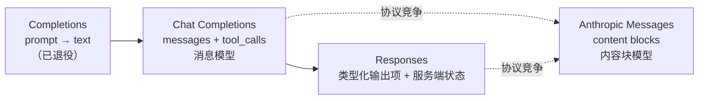

# 三套现行 LLM API 对照详解：Chat Completions · Responses · Anthropic Messages

> **视频**：[从 Completions 到 Responses：三代 LLM API 演化实录](https://www.bilibili.com/video/BV1ZWgs6FEZ9/)  
> **UP 主**：是的iamrio｜**发布**：2026-08-13｜**时长**：15:29  
> **事实主干**：B站 AI 字幕（agent-reach / OpenCLI，378 段时间轴字幕）  
> **证据等级**：`bilibili-ai-subtitles`；涉及厂商性能和路线判断的内容保留为视频观点，未视为独立实验结论
>
> **编排说明**：本笔记源自视频《从 Completions 到 Responses：三代 LLM API 演化实录》，重构为三套现行 API 的平行对照讲解——略去已退役的第一代 Completions，聚焦 **OpenAI Chat Completions**、**OpenAI Responses**、**Anthropic Messages**，三者用同一个「查天气」任务对照讲解。每套 API 附「字段小课堂」（速查表 + 高频字段展开 + 实战变体），为笔记扩展内容，依据三大官方文档通识整理，具体以最新 SDK 文档为准。阅读路径：初学按一 → 二 → 三顺读；查字段用各节「字段小课堂」；写适配层直接看「四、横向对比」和文末「术语速查表」。

## 一句话总论

> **LLM API 的演化，本质是模型能力边界的外显：从"给一段 prompt 续写文本"，到"理解结构化对话并调用工具"，再到"让一次请求承载有状态的 Agent loop"。**

今天真正活跃的是三套协议。它们都能完成文本生成、图片输入和工具调用，但对"模型一次运行产生什么"的建模方式完全不同——差异不是字段改名，而是抽象不同。

## 三套现行 API 速览

| API | 厂商 | 核心抽象 | 一句话心智模型 | 状态管理 |
| --- | --- | --- | --- | --- |
| **Chat Completions** | OpenAI（事实行业标准） | 消息 | 对话 = 一份不断追加的 `messages` 列表 | 无状态，客户端重传全部历史 |
| **Responses** | OpenAI | 类型化输入/输出项 | 一次请求 = 一次模型运行，产出多种 item；多轮用 response id 串联 | 服务端可托管（`previous_response_id`） |
| **Messages** | Anthropic | 内容块 | 一轮回复 = 一组有类型的内容块（text / tool_use / thinking…） | 无状态，客户端重传全部历史 |



视频最后的判断：Completions 会逐渐退出历史舞台；Chat Completions 在很长一段时间内仍会是开源及国内 Provider 的主力兼容接口；Responses 更像面向 Agent 产品的高阶协议；Anthropic Messages 则以内容块模型与之竞争。

下面三节用**同一个任务**分别走一遍完整流程：用户问"上海天气怎么样？"，模型需要调用 `get_weather` 工具拿到结果后回答。

## 一、OpenAI Chat Completions：消息模型

**端点**：`POST /v1/chat/completions`　**认证**：`Authorization: Bearer $OPENAI_API_KEY`

### 心智模型

对话就是一份 `messages` 列表。每次请求都要把**全部历史**重传一遍，模型读完整个列表，产出**一条** assistant 消息。`developer`（新的系统指令角色）、`user`、`assistant`、`tool` 都是列表里的角色。

### 最简请求与响应

```json
{
  "model": "gpt-4o",
  "messages": [
    {"role": "developer", "content": "回答要简洁"},
    {"role": "user", "content": "上海天气怎么样？"}
  ]
}
```

响应——核心在 `choices[0].message`，`finish_reason` 说明为什么停止：

```json
{
  "id": "chatcmpl-001",
  "choices": [{
    "index": 0,
    "message": {"role": "assistant", "content": "上海今天晴，气温 25°C。"},
    "finish_reason": "stop"
  }],
  "usage": {"prompt_tokens": 24, "completion_tokens": 12, "total_tokens": 36}
}
```

`finish_reason` 常见取值：`stop`（正常结束）、`length`（达到 max_tokens）、`tool_calls`（模型要求调用工具）、`content_filter`。

顺带看懂 `usage`：`prompt_tokens` = 输入成本、`completion_tokens` = 输出成本。推理模型的思考 token 也算在 completion 里并计费，会在 `usage.completion_tokens_details.reasoning_tokens` 单列——排查"成本怎么这么高"时先看它。

### 字段小课堂：一次请求里每个字段都是干嘛的

> [!tip] 怎么读这一节
> 先背 **必填的两个**（`model`、`messages`），记住 **场景高频的四五个**，其余扫一眼混个脸熟——要用时回来查表即可。

#### 请求字段速查表

| 字段                                       | 必填  | 作用                                                  | 使用频率                   |
| ---------------------------------------- | --- | --------------------------------------------------- | ---------------------- |
| `model`                                  | ✅   | 选哪个模型                                               | 每次必填                   |
| `messages`                               | ✅   | 对话历史数组，协议的核心                                        | 每次必填                   |
| `temperature`                            | –   | 随机度（0~2），越大越发散                                      | 高频                     |
| `max_completion_tokens`                  | –   | 输出上限（旧名 `max_tokens`，推理模型只认新名）                      | 高频                     |
| `reasoning_effort`                       | –   | 思考强度（`low/medium/high`，GPT-5 系另有 `minimal`），仅推理模型生效 | 推理模型高频                 |
| `tools` / `tool_choice`                  | –   | 工具定义 / 调用策略                                         | Agent 场景高频             |
| `response_format`                        | –   | 强制结构化输出（JSON）                                       | 抽取场景高频                 |
| `stream` + `stream_options`              | –   | SSE 开关 + 让最后一帧带 usage                               | 产品里高频                  |
| `top_p`                                  | –   | 核采样截断                                               | 低频（与 temperature 二选一调） |
| `n`                                      | –   | 一次生成几条候选（这就是 `choices` 是数组的原因）                      | 低频                     |
| `stop`                                   | –   | 输出出现指定字符串就"刹车"                                      | 低频                     |
| `seed`                                   | –   | 尽力而为的复现种子                                           | 低频                     |
| `frequency_penalty` / `presence_penalty` | –   | 抑制重复的惩罚项                                            | 很少用（老时代产物）             |
| `logprobs`                               | –   | 返回每个 token 的概率                                      | 研究 / 置信度分类             |
| `parallel_tool_calls`                    | –   | 设 false 禁止一次调多个工具                                   | Agent 偶尔用              |
| `user`                                   | –   | 终端用户标识，供滥用监控                                        | 合规场景                   |

#### 高频字段展开

**`messages`：数组就是模型的全部世界。** 模型只看得见你发来的东西——所谓"多轮对话"全靠你自己维护这个数组。四种角色各司其职：`system`/`developer` 定行为、`user` 是用户输入、`assistant` 是模型说过的话（含工具调用）、`tool` 是工具结果。`content` 除了纯字符串，还能传内容块数组（多模态就靠它）：

```json
{"role": "user", "content": [
  {"type": "text", "text": "这张图里是什么？"},
  {"type": "image_url", "image_url": {"url": "https://…"}}
]}
```

**`temperature`：一个旋钮定调性。** 抽取、分类、代码、Agent 等要"稳"的场景用 0~0.2；聊天、写作等要"活"的场景用 0.7+。`top_p` 别和它同时调，会互相干扰。

**`tools` + `tool_choice`：`tool_choice` 是策略位。** `"auto"`（默认，模型自己决定调不调）、`"none"`（禁用工具）、`"required"`（必须调一个）、`{"type": "function", "function": {"name": "get_weather"}}`（指定只能调它）。小技巧：做信息抽取时用 `required` + 指定函数，等于把工具调用当结构化输出用。

**`response_format`：要 JSON 给 JSON。** `{"type": "json_object"}` 保证输出是合法 JSON（需在 prompt 里提到"json"）；`{"type": "json_schema", "json_schema": {…}}` 严格按 schema 生成，数据管道必备。

**推理模型的思考旋钮：`reasoning_effort` + `max_completion_tokens`。** CC 里也有思考强度控制：顶层扁平参数 `reasoning_effort`（`"low"` / `"medium"` / `"high"`，GPT-5 系另有 `"minimal"`）——和 Responses 里嵌套的 `reasoning.effort` 是同一旋钮的两种摆法。但注意两点差异：① `max_completion_tokens` 是**思考 + 输出**的总预算，思考 token 也计入并计费，预算给太小会出现 `finish_reason="length"` 且 `content` 为空（全被思考吃光了，推理模型最常见的"没输出"事故）；② 思考过程本身**看不见也带不走**——usage 里只有 token 计数，没有摘要，也不能跨轮保留（见下文痛点 4）。想看思考原文反而是 DeepSeek-R1 这类厂商方言（`reasoning_content` 字段）和 Anthropic 的 `thinking` 块能做到。

#### 生态变体：一套协议，各家方言

Chat Completions 最大的现实是——**它是全行业的"普通话"**。DeepSeek、Kimi、Qwen、GLM、OpenRouter，以及本地 vLLM / Ollama / LM Studio，全都兼容这套协议，换模型 ≈ 改 `base_url` 和 `model` 两个字符串。但各家有方言，常见差异：

- **角色名**：新版 OpenAI 用 `developer`，多数兼容厂商仍只认 `system`——兼容代码里两个都要处理；
- **思考字段**：DeepSeek-R1 类推理模型会在 message 里多吐一个私有字段 `reasoning_content`（思考过程），OpenAI 官方没有；Qwen3 用 `enable_thinking` 开关——做兼容层时按厂商探测；
- **参数名**：部分厂商只认旧名 `max_tokens`；
- **能力缺口**：小厂可能不支持 `tool_calls`、`json_schema` 或流式工具参数，接入前做能力探测。

> [!tip] 实战心法
> 核心字段按官方规范写，方言字段包一层适配 + 探测，不要把厂商私有字段写死在业务代码里。

### 完整流程：查天气（工具调用）

**第 1 步**：声明工具，发起请求。

```json
{
  "model": "gpt-4o",
  "messages": [
    {"role": "user", "content": "上海天气怎么样？"}
  ],
  "tools": [{
    "type": "function",
    "function": {
      "name": "get_weather",
      "description": "查询指定城市当前天气",
      "parameters": {
        "type": "object",
        "properties": {"city": {"type": "string"}},
        "required": ["city"]
      }
    }
  }],
  "tool_choice": "auto"
}
```

**第 2 步**：模型不直接回答，而是返回 `finish_reason="tool_calls"`。注意参数是 **JSON 字符串**（不是对象，客户端要自己 `json.loads`）：

```json
{
  "choices": [{
    "message": {
      "role": "assistant",
      "content": null,
      "tool_calls": [{
        "id": "call_1",
        "type": "function",
        "function": {"name": "get_weather", "arguments": "{\"city\": \"上海\"}"}
      }]
    },
    "finish_reason": "tool_calls"
  }]
}
```

> [!info] 小课堂：`arguments` 是什么？为什么要自己 `json.loads`？
> **`arguments` = 模型这次调用填好的实参。** 编程惯例：`parameter` 是形参——你声明工具时的 `parameters`（"本函数需要一个 city"）；`argument` 是实参——模型从用户话里抽出 `city="上海"` 后填好的值。Anthropic 给同一个概念起名叫 `input`。
>
> **为什么要自己解析？** "JSON 对象"是内存里的数据结构（Python `dict`，能直接取键）；"JSON 字符串"只是一段长得像 JSON 的**文本**，什么都取不了：
>
> ```python
> raw = '{"city": "上海"}'   # str：不能 raw["city"]
> args = json.loads(raw)     # 文本 → dict
> args["city"]               # ✅ '上海'
> ```
>
> 解析分两层：整个响应是个快递箱，SDK 已替你拆一次箱（响应文本 → 对象，所以能用 `resp.choices[0]` 点号取值）；`arguments` 是箱内的**密封小信封**，第二次拆箱永远是你自己的事。Anthropic 的 `input` 则是箱内已摆好的物品，拿来即用。**时机**：非流式 = 收到回复后立刻解析；流式 = 按 `index` 攒齐参数碎片、流结束后再解析。记得包 `try/except`——流被 `length` 截断时常留下半截字符串。

**第 3 步**：客户端执行 `get_weather("上海")`，把**两条**消息追加回列表——assistant 的 `tool_calls` 原样回填 + `tool` 结果——再次请求（工具结果是结构化数据时，惯例先 `json.dumps` 成字符串再放进 `content`；本例结果本身就是短文本，直接放了）：

```json
{
  "model": "gpt-4o",
  "messages": [
    {"role": "user", "content": "上海天气怎么样？"},
    {"role": "assistant", "content": null, "tool_calls": [
      {"id": "call_1", "type": "function",
       "function": {"name": "get_weather", "arguments": "{\"city\": \"上海\"}"}}
    ]},
    {"role": "tool", "tool_call_id": "call_1", "content": "晴，25°C"}
  ]
}
```

（`tools` 定义原样带上，此处省略。）

**第 4 步**：模型拿到工具结果，输出最终回答，`finish_reason="stop"`。整个流程的消息形状：

```text
user → assistant(tool_calls) → tool(result) → assistant(final text)
```

> [!warning] 最容易踩的坑
> assistant 的 `tool_calls` 消息和对应的 `tool` 结果**必须成对回填**；在两者之间插入无关消息，模型可能把它误当作工具结果。`tools[].function.parameters` 的三层嵌套结构，也是这套协议最常被吐槽的地方。

### 流式输出：delta 拼接

> [!info] 术语：SSE（Server-Sent Events，服务器推送事件）
> 三家 LLM API 流式输出共用的底层技术：客户端发一个普通 HTTP 请求，服务端保持连接不断开，把生成内容分成小块持续写回（响应头 `Content-Type: text/event-stream`）。报文规则只有三条——`data:` 行是数据载荷、**空行分隔事件**、`event:` 行（可选）给事件命名。它是单向推送（服务端→客户端），比 WebSocket 简单得多；下文的 `[DONE]` 是 OpenAI 自己约定的结束哨兵，不属于 SSE 规范。

SSE 里都是同一种 `data` 事件，客户端从 `delta` 里逐段拼内容，靠状态机区分"这是文本还是工具参数"：

```text
data: {"choices":[{"delta":{"role":"assistant","content":""}}]}

data: {"choices":[{"delta":{"content":"上海今天晴"}}]}

data: {"choices":[{"delta":{"content":"，25°C。"}}]}

data: {"choices":[{"delta":{},"finish_reason":"stop"}]}

data: [DONE]
```

同一个 `delta` 字段，可能装的是文本片段、`tool_calls` 的参数片段（`function.arguments` 增量），或空对象（仅携带 finish_reason）。

### 工程痛点：五个症状，一个根源

> **根源只有一个：CC 的世界观是"无状态的一问一答"。** 它只认识"给我一份完整消息列表，我还你一条消息"——凡是比一问一答复杂的东西（循环、解析、流语义、记忆、能力开关），API 一概不管，全部漏到你的客户端代码里。

**1. Agent loop 要自己拼。** 模型只是"说"它想调工具，真正执行、回填、再请求的循环全在你手里——while 循环 + 解析 + 配对回填，每个项目重写一遍（见上文查天气流程）。

**2. 返回结构嵌套且多态。** 拿到工具参数要走四层：`choices[0].message.tool_calls[0].function.arguments`；且同一个 `message` 对象是**多态**的——`content` 有文本、`content: null` 只剩 `tool_calls`、甚至两者并存，解析代码每种都得判断。

**3. 流式语义弱。** 只有一种 `data` 事件，**同一个 `delta` 字段三种含义**，全靠状态机猜：

```text
data: {"choices":[{"delta":{"content":"上海"}}]}                ← 文本片段
data: {"choices":[{"delta":{"tool_calls":[{"index":0,
        "function":{"arguments":"{\"ci"}}]}}]}                  ← 工具参数碎片：按 index 攒齐才能解析
data: {"choices":[{"delta":{},"finish_reason":"tool_calls"}]}   ← 结束信号：delta 是空的
```

**4. 推理状态跨轮丢失。** 每次调用都是全新运行：服务端不记得上一轮模型"想过什么"，协议里也没有字段能把推理过程还回去——模型要么重新想一遍（更贵更慢），要么质量下降。

**5. 控制项平铺膨胀。** `response_format`、`tool_choice`、`parallel_tool_calls`、`stream_options`、`seed`、`logprobs`……每加一个能力就往请求顶层塞一个开关，API 表面积越滚越大。

#### Responses 如何逐条收编

| 痛点 | 根源 | Responses 的解法 |
| --- | --- | --- |
| 1. loop 自己拼 | 无状态 | `previous_response_id` 状态托管 + 内置工具 |
| 2. 嵌套多态 | 一条 message 装所有 | 类型化 `output[]` item，按 type 分发 |
| 3. 流式靠猜 | 单一 delta | 命名事件，听名字就知道往哪个桶放 |
| 4. 推理丢失 | 每次全新运行 | 服务端连推理状态一起托管 |
| 5. 开关膨胀 | 历史兼容包袱 | 结构归位：工具扁平化、内置工具就是一种 tool type |

一句公道话：这些痛点对**简单场景**根本不成立——"无状态、一问一答"换来的正是极简心智模型和最强生态兼容。**2023 年后最广泛兼容的主流协议**、几乎所有开源推理框架和国内 Provider 的基线，不是白来的；让 CC 力不从心的，只有**复杂 Agent 场景**。

## 二、OpenAI Responses：类型化输出项 + 服务端状态

**端点**：`POST /v1/responses`　**认证**：`Authorization: Bearer $OPENAI_API_KEY`

### 心智模型

一次请求 = 一次完整的**模型运行**。运行可以产出多种类型的 item（推理、工具调用、文本、内置工具执行……），它们平铺在 `output` 数组里。多轮对话不再要求重传历史——用 `previous_response_id` 指向上一轮，服务端替你记住上下文。

视频的定位概括：**一次请求承载"用户发话 → 模型推理 → 工具执行 → 继续推理 → 最终回复"的完整过程**。

### 最简请求与响应

`input` 可以直接是字符串；系统指令放在顶层 `instructions`：

```json
{
  "model": "gpt-5",
  "instructions": "回答要简洁",
  "input": "上海天气怎么样？"
}
```

响应的核心是带 `type` 的 `output` 数组：

```json
{
  "id": "resp_001",
  "status": "completed",
  "output": [
    {"type": "reasoning", "id": "rs_1", "summary": []},
    {"type": "message", "id": "msg_1", "role": "assistant",
     "content": [{"type": "output_text", "text": "上海今天晴，气温 25°C。", "annotations": []}]}
  ],
  "usage": {"input_tokens": 24, "output_tokens": 12, "total_tokens": 36}
}
```

| `type` | 含义 |
| --- | --- |
| `reasoning` | 推理内容或摘要 |
| `message` | 文本回复（`content[].output_text`） |
| `function_call` | 客户端自定义工具调用 |
| `web_search_call` / `file_search_call` / `code_interpreter_call` | 服务端内置工具执行记录 |

SDK 提供 `response.output_text` 这类便捷聚合属性；客户端可以按 `type` 分发处理，不必再猜一个通用 message 对象里到底装的是文本、工具调用还是拒答。

### 字段小课堂：从请求字段看"状态托管"怎么用

#### 请求字段速查表

| 字段                      | 必填  | 作用                                                     | 使用频率     |
| ----------------------- | --- | ------------------------------------------------------ | -------- |
| `model`                 | ✅   | 选哪个模型                                                  | 每次必填     |
| `input`                 | ✅   | 字符串（简单）或类型化 item 数组（正经）                                | 每次必填     |
| `instructions`          | –   | 系统指令（无状态，不随 `previous_response_id` 继承）                 | 高频       |
| `previous_response_id`  | –   | 挂到上一轮，服务端续写状态                                          | 多轮必会     |
| `store`                 | –   | 是否让服务端保存本次 response（默认 `true`，约 30 天）                  | **重要**   |
| `tools`                 | –   | 扁平函数工具 / `web_search` 等内置工具                            | Agent 高频 |
| `reasoning`             | –   | `{"effort": "low\|medium\|high", "summary": …}` 控制思考深度 | 推理模型高频   |
| `text.format`           | –   | 结构化输出（对应 CC 的 `response_format`）                       | 抽取高频     |
| `max_output_tokens`     | –   | 输出上限（注意不叫 `max_tokens`）                                | 高频       |
| `temperature` / `top_p` | –   | 采样控制，同 CC                                              | 中频       |
| `stream`                | –   | SSE 流式                                                 | 产品高频     |
| `truncation`            | –   | `"auto"`：状态链超长时自动截掉最老的                                 | 长会话      |
| `background`            | –   | 异步模式：立刻返回，稍后轮询                                         | 分钟级长任务   |
| `include`               | –   | 额外索取字段，如加密的推理内容                                        | 特殊合规     |
| `metadata`              | –   | 自定义键值，跟着 response 存                                    | 归档检索     |

#### 响应字段怎么看

- `id`（`resp_…`）：链条锚点，下一轮的 `previous_response_id` 就是它；
- `status`：`completed` / `failed` / `in_progress`（异步模式会见到）；
- `output[]`：类型化 item 数组，按 `type` 分发（见上文流程）；
- `usage`：`input_tokens` / `output_tokens` / `total_tokens`，推理模型的 **reasoning tokens 单列在内**——成本大头可能在这里；
- `output_text`：SDK 提供的聚合便捷属性，快速拿纯文本用。

#### 高频字段展开

**`input` 的两种形态。** 懒人模式直接给字符串；正经模式给 item 数组：`{"type": "message", "role": "user", "content": "…"}`。两者可以混用——挂 `previous_response_id` 时只提交增量（如 `function_call_output`）；想"篡改/重建历史"时也可以不挂 ID、全量传 item 数组，退回和 CC 一样的手动模式。

**`store`：心智分水岭。** 默认 `true`，服务端保存这条 response（约 30 天），`previous_response_id` 依赖它。设 `false` 即完全无状态——隐私合规场景用，但多轮就得自己全量传历史。

**`reasoning.effort`：思考深度旋钮。** `low/medium/high` 直接决定模型花多少 thinking tokens——质量和成本的直接交换。`reasoning.summary` 还能让服务端返回思考摘要（前端展示"正在想什么"就靠它）。

**`truncation`：状态托管的保险丝。** 上下文由服务端续写，越滚越长，`"auto"` 让服务端自动截断最老内容防爆窗。

#### 模式变体：官方提供的几种运行模式

它不像 CC 那样有厂商方言，变体主要是**官方运行模式**：

1. **无状态模式**：`store: false`——合规 / 零保留场景；
2. **异步模式**：`background: true` → 立即拿到 `resp_id` → 轮询 `GET /v1/responses/{id}`——深度研究类分钟级任务；
3. **加密推理模式**：`store: false` + `include: ["reasoning.encrypted_content"]`——推理状态加密后交还客户端自己保管，服务端不留明文，兼得"状态延续"与"零保留"；
4. **conversation 对象**：比 `previous_response_id` 更进一步的会话容器抽象，把"一场对话"当资源管理。

但**第三方兼容是重灾区**：很多声称兼容 Responses 的端点只实现了 `input`/`tools` 表层，`previous_response_id`、内置工具、加密推理往往没有（视频提到 DeepSeek 仅部分支持）。用前先探测，别假设能力等价。

### 完整流程：查天气（previous_response_id 串联）

**第 1 步**：工具定义是**扁平结构**——`name`、`parameters` 直接放在工具对象上，不再嵌套在 `function` 里：

```json
{
  "model": "gpt-5",
  "instructions": "回答要简洁",
  "input": "上海天气怎么样？",
  "tools": [{
    "type": "function",
    "name": "get_weather",
    "description": "查询指定城市当前天气",
    "parameters": {
      "type": "object",
      "properties": {"city": {"type": "string"}},
      "required": ["city"]
    }
  }]
}
```

注意：默认情况下，这份 schema（描述 + 参数）会**全量注入模型上下文**，并且**每一轮请求都要重复带上**——单工具无感（本例就是），工具一多就挤占 token 和 KV Cache，这正是下文「工具延迟加载与 tool_search」要解决的问题。

**第 2 步**：工具调用不再"藏在 message 里"，而是显式的 `function_call` item：

```json
{
  "id": "resp_001",
  "status": "completed",
  "output": [
    {"type": "reasoning", "id": "rs_1", "summary": []},
    {"type": "function_call", "id": "fc_1", "call_id": "call_1",
     "name": "get_weather", "arguments": "{\"city\": \"上海\"}"}
  ]
}
```

**第 3 步**：客户端执行函数，提交 `function_call_output`，并用 `previous_response_id` 挂到上一轮——**不需要重传历史消息，也不需要回填 assistant 消息**：

```json
{
  "model": "gpt-5",
  "instructions": "回答要简洁",
  "previous_response_id": "resp_001",
  "input": [{
    "type": "function_call_output",
    "call_id": "call_1",
    "output": "晴，25°C"
  }]
}
```

**第 4 步**：返回新的 response（`resp_002`），`output` 里带最终的 message item。

> [!note] `instructions` 不随 `previous_response_id` 继承
> 它是无状态字段，每轮都要重新传；或者改在 `input` 里使用 `developer` 角色承载稳定指令。

与 Chat Completions 对照：CC 要回填"assistant tool_calls + tool 结果"两条消息；Responses 只提交一条 `function_call_output`，历史由服务端托管。

### 服务端内置工具

除了自定义函数，可以直接声明 `web_search`、`file_search`、`code_interpreter` 等服务端工具——搜索执行、限流、结果解析全部由服务端完成：

```json
{
  "model": "gpt-5",
  "input": "OpenAI 最近一周有什么发布？给出来源",
  "tools": [{"type": "web_search"}]
}
```

返回中会出现 `web_search_call` item，文本里带结构化引用标注：

```json
{
  "output": [
    {"type": "web_search_call", "id": "ws_1", "status": "completed",
     "action": {"type": "search", "query": "OpenAI 最新发布"}},
    {"type": "message", "role": "assistant",
     "content": [{"type": "output_text", "text": "……",
       "annotations": [{"type": "url_citation", "url": "https://…", "title": "…"}]}]}
  ]
}
```

职责边界就此改变：客户端从"接搜索服务、解析结果、拼上下文"变成"声明工具、接收结构化结果"。代价是数据出域和服务商绑定更明显。

### 工具延迟加载与 tool_search

工具很多时，不必在每次请求里注入全部 schema：

- 工具定义标记 `defer_loading: true`，默认只暴露名称或简述；
- 模型需要时发起 `tool_search`，客户端检索后返回 `tool_search_output`，附上完整工具 schema；
- 模型再基于已注入的工具继续调用。

这相当于把"工具路由 + 渐进式披露"升级为 API 能力，减少静态工具定义对上下文和 KV Cache 的占用。（用 Chat Completions 自行实现类似机制，需要维护双层路由，且工具集合变化容易造成缓存失效。）

### 流式输出：有名字的事件

不再是一种 `data` 走天下，事件名自带语义：

```text
event: response.output_text.delta
data: {"type": "response.output_text.delta", "delta": "上海今天晴"}

event: response.output_text.delta
data: {"type": "response.output_text.delta", "delta": "，25°C。"}

event: response.function_call_arguments.delta
data: {"type": "response.function_call_arguments.delta", "delta": "{\"city\""}

event: response.completed
data: {"type": "response.completed", "response": {"id": "resp_002", "...": "..."}}
```

可靠性更好；但事件类型超过 20 种，客户端要实现事件分发器。对只需要普通问答的应用，这些原始事件反而显得冗余。

### 推理状态跨轮保留

用 `previous_response_id` 串联多轮时，模型的推理状态可以延续。视频引用 OpenAI 自家基准：TauBench 约提升 5%，缓存利用率从约 40% 提升到 80%——**这些是厂商数据**，是否适合自己的代码审查、数学证明或复杂决策任务，需要自行验证。

### 代价与边界

- **上下文主动权减少**：服务端托管历史后，压缩上下文、切换 session、精细裁剪都不如手动 messages 灵活。
- **Provider 兼容性不齐**：很多声称兼容 Responses 的服务商只实现了表层请求格式，状态托管、内置工具、reasoning 持久化未必支持（视频提到 DeepSeek 仅提供部分能力）。
- **数据与服务商绑定**：状态、工具执行、推理链留在 OpenAI 服务端，开发体验提升，但数据出域可控性下降。

## 三、Anthropic Messages：内容块模型

**端点**：`POST /v1/messages`　**认证**：`x-api-key: $ANTHROPIC_API_KEY` + `anthropic-version` 请求头

### 心智模型

一轮 assistant 回复 = 一组**有类型的内容块**（content blocks）。文本、图片、思考和工具调用共享同一个块抽象，可以在同一轮里混排。两个硬性差异要先记住：

- **`max_tokens` 是必填项**（OpenAI 两套 API 都是可选）；
- **工具结果没有独立的 `tool` 角色**——它是 `tool_result` 块，放在下一条 **user** 消息里。

### 最简请求与响应

```json
{
  "model": "claude-sonnet-4-5",
  "max_tokens": 1024,
  "system": "回答要简洁",
  "messages": [
    {"role": "user", "content": "上海天气怎么样？"}
  ]
}
```

响应——`content` 是块数组，`stop_reason` 对应 OpenAI 的 `finish_reason`：

```json
{
  "id": "msg_001",
  "role": "assistant",
  "content": [{"type": "text", "text": "上海今天晴，气温 25°C。"}],
  "stop_reason": "end_turn",
  "usage": {"input_tokens": 25, "output_tokens": 15}
}
```

`stop_reason` 常见取值：`end_turn`、`max_tokens`、`stop_sequence`、`tool_use`。

### 字段小课堂：必填的 `max_tokens` 与手动挡缓存

#### 请求字段速查表

| 字段                      | 必填  | 作用                                              | 使用频率     |
| ----------------------- | --- | ----------------------------------------------- | -------- |
| `model`                 | ✅   | 选哪个模型                                           | 每次必填     |
| `max_tokens`            | ✅   | 输出上限——**Anthropic 必填**（开思考还要给思考留预算）             | 每次必填     |
| `messages`              | ✅   | 轮次数组，user/assistant 交替，首条必须是 user               | 每次必填     |
| `system`                | –   | 顶层系统指令，可挂 `cache_control` 做缓存                   | 高频       |
| `tools` / `tool_choice` | –   | 工具定义 / 策略：`auto` / `any` / 指定 `tool` / `none`   | Agent 高频 |
| `thinking`              | –   | `{"type": "enabled", "budget_tokens": N}` 开思考模式 | 推理场景高频   |
| `temperature`           | –   | 0~1（范围和 OpenAI 的 0~2 不同！）                       | 高频       |
| `stop_sequences`        | –   | 停止序列（对应 CC 的 `stop`）                            | 中频       |
| `stream`                | –   | SSE 流式                                          | 产品高频     |
| `top_p` / `top_k`       | –   | 采样控制（`top_k` 是 Anthropic 特有）                    | 低频       |
| `metadata.user_id`      | –   | 终端用户标识                                          | 合规       |

#### 响应字段怎么看

- `content[]`：**块数组**才是主角（见上文流程）；
- `stop_reason`：`end_turn` / `max_tokens` / `tool_use` / `stop_sequence`——实际项目里 `max_tokens` 出现频率比 OpenAI 高，因为很多人忘了给思考留预算；
- `usage`：除了 `input_tokens` / `output_tokens`，还有 `cache_read_input_tokens` / `cache_creation_input_tokens`——**缓存命中看这里**。

#### 高频字段展开

**`max_tokens` 为什么必填？** Anthropic 把它当成本硬约束而非软上限，逼你为每次调用定价。新手两大坑：① 开思考时忘了留预算（`budget_tokens` 必须小于 `max_tokens`），结果 `stop_reason=max_tokens` 被截断；② 以为不填会有默认值，直接 400 报错。

**`messages` 的交替律。** user / assistant 必须严格交替，第一条必须是 user；连续同角色会报错（需要自己合并）。工具结果 `tool_result` 也遵守这条——它是 user 消息里的块（见上文流程）。

**`system` + `cache_control`：手动挡的提示缓存。** 和 OpenAI 的全自动缓存不同，Anthropic 要你**显式声明缓存断点**：

```json
"system": [
  {"type": "text", "text": "几千字的项目规范……", "cache_control": {"type": "ephemeral"}}
]
```

断点之前的前缀命中即按缓存价计费（读约 1 折、写 1.25 倍，默认 5 分钟 TTL）。大 system、长工具表、长文档场景**必挂**——这是用 Anthropic 省钱的第一招；命中与否看 `usage.cache_read_input_tokens`。

**`thinking`：思考也是块。** 开启后 assistant 轮会多出 `thinking` 块（带签名的思考内容）。工具循环里**必须把当前轮的 thinking 块原样传回**，否则报错——三套协议里独一份的回传义务。

#### 内容块家族与周边变体

- **块类型全家福**：`text` / `image` / `tool_use` / `tool_result` / `thinking` / `redacted_thinking` / `document`（PDF 直读）——一套 block 抽象吃下多模态；
- **内置工具也是工具类型**：`web_search`、`code_execution` 等以版本号命名的服务端工具，思路与 Responses 内置工具一致；
- **兄弟端点**：`/v1/messages/count_tokens`（发送前精确算成本）、`/v1/messages/batches`（异步批量，约半价）；
- **托管方言**：走 AWS Bedrock 或 GCP Vertex 时端点和鉴权不同，请求体协议一致。

### 完整流程：查天气（tool_use / tool_result）

**第 1 步**：声明工具，参数 schema 字段叫 `input_schema`（不是 `parameters`）：

```json
{
  "model": "claude-sonnet-4-5",
  "max_tokens": 1024,
  "messages": [{"role": "user", "content": "上海天气怎么样？"}],
  "tools": [{
    "name": "get_weather",
    "description": "查询指定城市当前天气",
    "input_schema": {
      "type": "object",
      "properties": {"city": {"type": "string"}},
      "required": ["city"]
    }
  }]
}
```

**第 2 步**：同一轮回复里，文本和工具调用作为**并列的块**出现，`stop_reason="tool_use"`。注意 `input` 直接就是 **JSON 对象**——不用 `json.loads`（对比 CC 的 `arguments` 字符串，见第一节查天气第 2 步的小课堂，这是三家里工具参数最省事的）：

```json
{
  "id": "msg_001",
  "role": "assistant",
  "content": [
    {"type": "text", "text": "我来查询一下。"},
    {"type": "tool_use", "id": "toolu_1", "name": "get_weather",
     "input": {"city": "上海"}}
  ],
  "stop_reason": "tool_use"
}
```

**第 3 步**：把 assistant 整轮（含所有块）追加回历史，工具结果作为 `tool_result` 块放进**新的 user 消息**：

```json
{
  "model": "claude-sonnet-4-5",
  "max_tokens": 1024,
  "messages": [
    {"role": "user", "content": "上海天气怎么样？"},
    {"role": "assistant", "content": [
      {"type": "text", "text": "我来查询一下。"},
      {"type": "tool_use", "id": "toolu_1", "name": "get_weather",
       "input": {"city": "上海"}}
    ]},
    {"role": "user", "content": [
      {"type": "tool_result", "tool_use_id": "toolu_1", "content": "晴，25°C"}
    ]}
  ]
}
```

> [!info] 三个 id 别混
> 这段流程出现了三种标识：① `msg_001`——整条响应的身份（顶层 `id`）；② `tool_use` 块自己的 `id`（`toolu_1`）——**这一次工具调用**的身份；③ `tool_result` 里的 `tool_use_id`——**引用字段**，值必须等于 ②，意思是"我是对 toolu_1 那次调用的答复"。②和③不是两种号，是**同一个号的两端**：调用时领号，结果凭号认领。为什么必须靠 id 认亲——一轮里可以并发多个 `tool_use`（如 toolu_1 查天气 + toolu_2 查机票），多个 `tool_result` 挤在同一条 user 消息里，全靠 `tool_use_id` 硬绑定。三套协议同构：CC 是 `tool_calls[].id` ↔ `tool_call_id`，Responses 是 `call_id` ↔ `call_id`，Anthropic 是 `tool_use.id` ↔ `tool_use_id`。

**第 4 步**：返回最终一轮纯文本块，`stop_reason="end_turn"`。整个流程的消息形状：

```text
user → assistant[text, tool_use] → user[tool_result] → assistant[text]
```

> [!warning] 最容易踩的坑
> `tool_result` 必须放在 assistant `tool_use` 轮次**紧后面**的 user 消息里，且 `tool_use_id` 要对得上——它不是独立角色，也不是 assistant 的块。多工具并发调用时，多个 `tool_result` 块放在同一条 user 消息里，与 `tool_use` 顺序对应。

### 流式输出：内容块生命周期事件

流式事件围绕"块"的生命周期：开始 → 增量 → 结束，多块依次出现：

```text
event: message_start
data: {"type": "message_start", "message": {"id": "msg_001", "...": "..."}}

event: content_block_start
data: {"type": "content_block_start", "index": 0,
       "content_block": {"type": "text", "text": ""}}

event: content_block_delta
data: {"type": "content_block_delta", "index": 0,
       "delta": {"type": "text_delta", "text": "上海今天晴，25°C。"}}

event: content_block_stop
data: {"type": "content_block_stop", "index": 0}

event: message_delta
data: {"type": "message_delta", "delta": {"stop_reason": "end_turn"}}

event: message_stop
data: {"type": "message_stop"}
```

工具调用对应 `content_block_start`（`type: "tool_use"`）+ `input_json_delta` 参数增量；开思考模式则是 `thinking_delta`。事件模型和 Responses 一样是"类型化事件"，但分块维度是"内容块"，不是"运行产物 item"。

### 特点与差异点

- **格式最规整**：一个 turn 内部结构统一（全是 block），最适合表达"文本 + 图片 + 工具"混合的复杂轮次。
- **工具参数是对象**：省一层 JSON 字符串解析（详见 CC 查天气第 2 步的小课堂 callout）。
- **与 OpenAI 协议不兼容**：顶层 `system`、工具结果角色、流式事件命名都不同，多 Provider 适配时要单独处理。
- **无服务端状态托管**：和 Chat Completions 一样重传历史，没有 `previous_response_id` 的等价物。

## 四、三套协议横向对比

### 核心字段对照表

| 维度 | Chat Completions | Responses | Anthropic Messages |
| --- | --- | --- | --- |
| 核心抽象 | 消息 | 输入/输出项 | 对话轮次与内容块 |
| 系统指令 | `messages` 中的 `developer/system` | 顶层 `instructions` 或输入项 | 顶层 `system` |
| 普通输出 | `choices[].message` | `output[]` 中的 message item | `content[]` 中的 text block |
| 工具调用 | assistant 的 `tool_calls` | 独立 `function_call` item | `tool_use` block |
| 工具参数 | JSON 字符串 | JSON 字符串 | JSON 对象 |
| 工具结果 | `role: tool` | `function_call_output` item | user message 中的 `tool_result` block |
| 对话状态 | 重传消息历史 | 可重传输入，也可 `previous_response_id` | 重传消息历史 |
| 流式模型 | `choices[].delta` | 按输出类型命名的事件 | 内容块开始/增量/结束事件 |
| 主要侧重 | 兼容性与简单聊天 | Agent、工具、多模态与状态 | 清晰的内容块和显式对话轮次 |

### 同一个"查天气"，三种流程形状

```text
Chat Completions : 请求(全部历史) → assistant(tool_calls) → 回填 assistant+tool 两条消息再请求 → assistant(文本)
Responses        : 请求 → function_call item → 只提交 function_call_output + previous_response_id → message item
Anthropic        : 请求 → assistant[text + tool_use 块] → user[tool_result 块] 再请求 → assistant[text 块]
```

### 为什么会有这些差异

- **Chat Completions 继承了文本补全接口的历史**：外层仍是 `choices` 和 `finish_reason`，核心对象从文本变成了 message；工具调用是聊天模型普及后逐步加入的，带着明显的兼容性包袱。
- **Responses 是面向 Agent 重新设计的统一接口**：它不假设一次模型运行只生成一条文本消息，而是允许推理、工具调用、文本作为并列输出项，并可通过 response ID 延续状态。
- **Anthropic 从内容块出发设计消息协议**：一个 assistant turn 天然可以混合多个 block，工具调用只是其中一种；单轮内部结构统一，但与 OpenAI 的角色和工具回传约定不兼容。

### 适配层的正确抽象

为多 Provider 系统设计适配层时，不应只在 `messages`、`input`、`content` 之间机械改字段。更稳妥的内部模型应显式区分：

```text
Instruction | UserContent | AssistantText | ToolCall | ToolResult | Reasoning | Usage
```

然后分别编码为三种 Provider 协议。这样才能正确处理一个响应中的多个工具调用、文本与工具混合输出、流式参数拼接以及不同的状态管理方式。

## 五、选型建议

| 场景 | 建议 | 原因 |
| --- | --- | --- |
| 单轮文本生成、已有旧系统 | Chat Completions | 改造成本低，生态成熟 |
| 自己控制完整 Agent loop | Chat Completions 或 Anthropic Messages | 消息、上下文、工具执行都可精细掌控 |
| OpenAI 原生 Agent、内置搜索/代码执行 | Responses API | 服务端工具和状态托管减少胶水代码 |
| 多 Provider / 私有化部署 | 以 Chat Completions 为基线，做能力探测 | Responses 的高级能力并不等价兼容 |
| 工具数量大、上下文紧张 | Responses + 延迟加载/tool search | 只按需注入工具 schema |
| Claude 系模型 / 混合内容轮次多 | Anthropic Messages | 内容块模型对多模态混合轮次表达最自然 |

## 术语速查表

同一个概念，三家的叫法——写适配层或翻文档时先查这张表：

| 概念 | Chat Completions | Responses | Anthropic Messages |
| --- | --- | --- | --- |
| 系统指令 | `messages` 里的 `developer`/`system` | 顶层 `instructions` | 顶层 `system` |
| 参数说明书（形参） | `tools[].function.parameters` | `tools[].parameters` | `tools[].input_schema` |
| 调用实参（模型填的） | `function.arguments`，**JSON 字符串** | `function_call.arguments`，**JSON 字符串** | `tool_use.input`，**JSON 对象** |
| 工具结果回传 | `role: "tool"` 消息 | `function_call_output` item | user 消息里的 `tool_result` 块 |
| 停止原因 | `finish_reason` | `status` + item 层细节 | `stop_reason` |
| 流式增量 | `choices[].delta` | `response.output_text.delta` 等命名事件 | `content_block_delta` |
| 思考 | `reasoning_effort`（只有强度） | `reasoning` item（强度 + 摘要） | `thinking` 块（预算 + 原文） |
| 多轮状态 | 客户端重传全部历史 | `previous_response_id` 服务端托管 | 客户端重传全部历史 |

## 可迁移的工程原则

1. **协议抽象应跟随能力抽象**：不要只把不同 API 的字段改名；要明确区分消息历史、工具调用、工具结果、推理状态和流式事件。
2. **把多态返回转成内部事件模型**：无论底层是 `tool_calls` 还是 `function_call` item，上层 Agent loop 都应消费统一事件。
3. **状态托管是取舍，不是免费抽象**：服务端状态降低编排成本，同时降低上下文裁剪、审计和迁移的自由度。
4. **工具 schema 是上下文资产**：工具越多，越需要延迟加载、检索和缓存策略，而不是盲目把所有定义塞进 system prompt。
5. **性能数字必须看证据来源**：厂商基准可作为假设和测试方向，不能直接当作跨模型、跨任务的普遍结论。

## 相关笔记

- [[Clippings/书籍/AI-Agents-in-Depth-zh-CN]]：Responses API、原生工具与渐进式工具披露
- [[Clippings/小红书/2026-08-07-实战从零开始构建Coding-Agent-Violin-小红书]]：不同 Provider 的协议适配与统一事件模型
- [[Clippings/微信公众号/2026-08-14-DeepSeek-Harness拆解-一套能拼装的Agent架构]]：客户端 Harness 如何承载 Agent loop

## 术语校正说明

字幕中将 `LLM API`、`function call`、`tool call`、`defer_loading`、`tool_search`、`TauBench` 等术语多次识别为近音中文或错误英文；本笔记按上下文和 API 常见命名统一校正。代码块是帮助理解的简化示意，不替代具体 Provider 的当前 SDK 文档。
