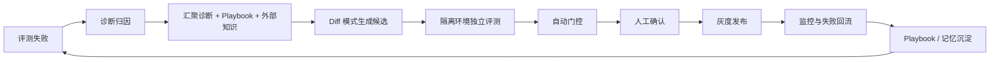

# Agent 自进化飞轮：评测 → 记忆 → 落地 → 控制

> [!summary] 核心观点
> 自进化不是让 Agent 自己“变聪明”，而是建立一条让执行结果被评测、经验被治理、改进被验证、风险被控制的工程闭环。

## 一句话结论

**评测是眼睛，记忆是大脑，Self-Improve 是手脚，人机协作是方向盘和刹车。** 只有打通“评测信号 → 记忆/Skill → 候选改进 → 门控/灰度 → 新数据回流”，Agent 才能持续产生复利。


## 一、先区分自进化改什么

| 层级 | 修改对象 | 持久性 | 建议 |
| --- | --- | --- | --- |
| Artifacts 迭代 | 本次答案、代码、方案 | 任务结束消失 | 已成熟，但不属于长期进化 |
| Harness 自改进 | Skill、Prompt、工具配置、工作流、记忆 | 跨会话生效 | 当前投入产出比最高 |
| Model 进化 | 模型参数、微调权重 | 最持久 | 成本和风险最高 |

**优先改 Harness，不要急着改模型。** 经过验证的 Skill 通常比重新训练更快、更可控，也更容易回滚。

## 二、评测：飞轮的信号源

评测不仅负责上线前打分，还承担三项职责：

1. **方向指引**：发现问题并指出改进方向；
2. **质量门控**：证明候选 Prompt/Skill 优于基线，防止回归；
3. **经验筛选**：决定一次结果是否值得沉淀为记忆。

### 评测体系的难题

- LLM Judge 偏爱长答案或表面格式；
- 只评最终答案，无法覆盖轨迹、工具调用和中间结果；
- 开放式任务难以量化；
- 评测集会漂移；
- 多采样、多重试带来的提升可能只是多花钱；
- 全量评测成本过高。

### 分层评测

- **规则层**：schema、SQL 结果、测试通过、耗时等客观指标；
- **语义层**：独立 Judge，temperature 设为 0，结构化输出，分维度评分；
- **人工层**：抽样复核 Judge，维护少量元评测集。

| 数据集 | 用途 | 约束 |
| --- | --- | --- |
| Train/诊断集 | 找失败模式、生成修复方向 | 可暴露给诊断模型 |
| Validation/筛选集 | 比较候选和基线 | 不暴露给修复生成模型 |
| Test/最终集 | 发布门禁 | 独立、冻结、低频使用 |

Skill 还需做有/无对照、难度校准、轨迹追踪和关键路径验证。


## 三、记忆：核心是治理，不是存储

向量库只能回答“存在哪里”，不能回答什么值得存、何时遗忘、冲突如何解决、如何精准召回。记忆更像 Git：要有版本、来源、审核、冲突解决和回滚。

### 写入、存储、读取三环

| 环节 | 关键问题 |
| --- | --- |
| 写入 | 价值判断、反馈归因、粒度和反例 |
| 存储 | 污染、时效衰减、冲突和成本 |
| 读取 | 检索噪声、上下文预算、任务匹配 |

### 策展式写入

- 用户确认、评测通过或任务明确成功后，才写入长期记忆；
- 失败经验可以保存，但标记为反例并解释不可行原因；
- 临时记录经多次验证后，才能晋升为正式 Skill/规则；
- 错误经验淘汰应快于正确经验强化（示意：正向 `+0.05`，负向 `-0.12`）。

### 分层与生命周期

```text
L0 原始会话 / 完整轨迹
L1 原子事实 / 经验
L2 场景块 / 可复用模式
L3 用户画像 / 稳定 Skill
```

默认读取高密度的 L3，需要证据时再向下回溯。每条记忆应记录版本、来源、触发原因和状态，并支持更新、合并、分裂、TTL、主动遗忘、冲突解决和乐观锁。


读取建议采用渐进披露：会话开始只注入 Persona/Skill 前言；任务到来后并行检索 Facts/Scenario；遇到疑问时再回溯原始轨迹。示例预算：Skill ≤ 2000 token、Facts ≤ 800 token、Profile ≤ 500 token，单条记忆 ≤ 200 token，最多注入 6 条。

## 四、落地：把修复做成 CI/CD

完全无人值守的“发现问题 → 修改 → 上线”风险很高。更稳妥的自动化范围是：**候选生成 → 独立评测 → 门控筛选**；高风险修改和关键决策保留人工确认。



关键约束：

- 修复方向至少汇聚本轮诊断、历史 Playbook、外部研究三路信号；
- 使用 Diff 模式，只改必要片段；
- 候选在独立沙箱中评测，避免相互污染；
- 门控顺序：语法 → 回归 → 统计显著性 → Playbook 一致性 → 人工确认；
- 通过后先小流量灰度，观察成功率、Token、延迟和用户反馈；
- P0 退化自动回滚；
- 记录每次版本、diff、触发来源和关联评测结果。


### Dreaming：异步发现跨会话模式

同步评测看不到慢变量。Dreaming 在空闲时审阅历史轨迹，寻找反复失败、低效成功路径和知识缺口，输出带优先级和影响评估的修订建议，但不应直接修改生产配置。建议每天或每周运行一次，人工审阅后进入流水线。

## 五、控制：分级自主，人是正确性保障

稳定领域可逐步放权；新领域、高风险操作和安全边界必须有人。通过率持续超过 95%、连续多周期无回归且人工抽检稳定后才升级；出现 P0 回归自动降级到严格审核。

必须有人参与的节点：

1. 规则级记忆写入前；
2. Prompt/Skill 更新最终确认；
3. 评测回归时决定回滚和修复优先级；
4. 新领域冷启动时提供初始评测集和安全边界；
5. 设定和调整 Agent 权限边界。

避免审核疲劳：自动门控先过滤大多数低质量候选，批量异步审核并附评测对比、影响范围、代表性样例和推荐理由；稳定运行后逐步放权，回归时自动降级。

防止对齐漂移需要：定期方向审计、监控输出长度/工具调用/拒答率等方向性指标，并在评测集加入简洁性、格式、语气和安全风格维度。


## 六、四个齿如何咬合

1. **评测 → 记忆**：成功结果和可复用经验进入策展式记忆；
2. **评测 → 落地**：失败模式和诊断驱动 Skill/Prompt 修复；
3. **落地 → 控制 → 生效**：候选经过门控、人工确认和灰度后才影响生产；
4. **生效 → 下一轮评测**：灰度期间样本回流，成为下一轮燃料。


### 从零到一

| 阶段 | 周期 | 目标 | 人工占比 |
| --- | --- | --- | --- |
| Phase 1：最小闭环 | 1～2 周 | 评测发现问题，记忆记住教训 | 80% |
| Phase 2：半自动化 | 2～4 周 | Skill 生成、CI 门禁、版本管理 | 40% |
| Phase 3：飞轮运转 | 1～2 月 | 灰度、回流、Dreaming、渐进放权 | 15% |
| Phase 4：元进化 | 持续 | Auto-Research、策略自优化、多 Agent 协同 | 5% |

优先跑通 Phase 1：能手动转一圈的粗糙飞轮，比自动化程度很高但从未闭环的蓝图更有价值。


## 工程化补充

- 每次运行绑定 `run_id`、`tenant_id`、`prompt_version`、`skill_version`、`memory_snapshot`、`eval_version`；
- 将 Playbook（如何改 Agent）与任务记忆（Agent 如何完成任务）分开；
- 规则级记忆、权限、安全策略和付费逻辑设置不可自动修改保护区；
- 结果评测与轨迹评测同时纳入门禁，并约束 Token、延迟和工具次数；
- 自动修复使用小范围 Diff、独立沙箱、可回滚版本和灰度流量。

## 最终提炼

1. **评测可信度 > 系统复杂度**：先校准“眼睛”，否则错误正反馈会加速污染；
2. **记忆是治理问题**：版本、来源、遗忘、冲突和晋升比向量库更重要；
3. **闭环价值在箭头**：评测、记忆、Skill、灰度和回流之间的数据通路才是复利来源。

## 相关资料

- [Anthropic：When AI Builds Itself](https://www.anthropic.com/research/when-ai-builds-itself)
- [Stanford CS329A：Self-Improving AI Agents](https://web.stanford.edu/class/cs329a/)
- [EvoAgentX](https://github.com/EvoAgentX/EvoAgentX)

## 图片说明

保留 7 张用于解释飞轮、评测、记忆、工程化、控制和落地路线的代表性配图，沿用原有 Gitee 图床链接。
