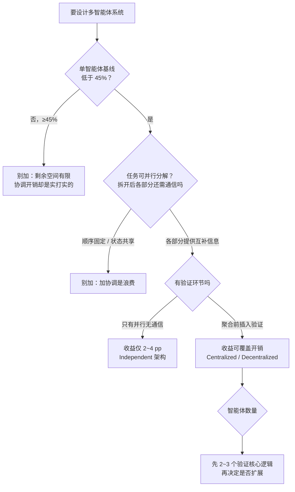

# Google 多智能体最佳实践：该不该上多智能体，是可以算出来的

> **来源**：公众号「Datawhale」，《重磅！Google发布多智能体最佳实践！》（2026-09-11），解读 Google Research / DeepMind / MIT 联合论文 *Towards a Science of Scaling Agent Systems*（[arXiv:2512.08296](https://arxiv.org/abs/2512.08296)）。
>
> **一句话总结**：多智能体好不好用，不取决于模型多强，取决于**任务结构适不适合分工**——论文把"什么时候该上多智能体"从经验直觉，换成了**三条判据 + 一条约束**的可计算预测模型。

## 0. 论文速览

| 维度 | 规模 |
| --- | --- |
| 受控配置 | 260 个 |
| 基准（benchmark） | 6 个：BrowseComp-Plus、Finance Agent、PlanCraft、Workbench、SWE-bench Verified、Terminal-Bench |
| 架构 | 5 种：SAS、Independent、Decentralized、Centralized、Hybrid |
| 模型家族 | 3 个：OpenAI GPT、Google Gemini、Anthropic Claude |

结论形态也变了：以前"什么时候用多智能体""用哪种架构"是**启发式说法**，这篇论文给的是**预测模型**——输入任务特征与模型能力，输出该用哪种架构。

## 1. 判断框架：三条判据 + 一条约束

| 判据 | 内容 | 分界线 / 证据 |
| --- | --- | --- |
| ① 基线水平 | 单智能体已经拿到大部分分数时，剩余空间有限，而协调开销是实打实付出的 | **45%** 是论文给出的分界线：低于它多智能体有发挥空间，高于它协调收益递减（全文最稳健的发现） |
| ② 能否并行分解 | 工具越多，可并行维度越多，分解收益越大。注意「可分解」不是「任务能不能拆成子任务」，而是**「拆开之后各部分还需不需要通信」** | 步骤顺序固定、状态共享 → 加协调是浪费；不同部分提供互补信息 → 加协调是杠杆 |
| ③ 防错靠什么 | 独立并行、彼此不通信的智能体谈不上协调；关键是在**聚合结果前插入验证环节** | 无通信无验证（Independent）收益仅 **2~4 个百分点**；Centralized 靠中央节点交叉核验、Decentralized 靠智能体互相质询，成功/成本比最高 |
| ⚠ 贯穿约束 | 智能体数量有最优值，且代价涨得比神经网络参数还快 | 见第 4 节 |

> **防错靠的是验证环节，不是智能体数量。** 协调不足时多出来的智能体没有验证机制，只是把同一个提示词跑几遍取平均。

## 2. 三种任务原型 → 三种不同答案

论文用三个原型示范"判据怎么用"，结论是**三种任务、三种架构，没有一种是"多智能体更强"**：

| 任务原型 | 具体场景 | 单智能体基线 | 结论架构 | 理由 |
| --- | --- | --- | --- | --- |
| **规划任务** | PlanCraft：3D 环境合成物品（查配方 → 拿材料 → 放进合成格 → 取出成品） | 已经不错 | **SAS**（单智能体） | 工具少，协调收益抵不过开销 |
| **分析任务** | 财务尽调：收入、成本、市场因素各成一块，可分头研究再汇总 | 中等 | **Centralized** | 有中央节点（orchestrator）分派任务，并在汇总前**交叉核验**各智能体输出 |
| **工具密集任务** | Workbench：提供 16 种工具 | 已经很高 | **Decentralized** | 工具多 → 可并行维度多；无中央节点，智能体之间直接通信、互相质询 |

**架构选得对不对，取决于任务长什么样、单智能体已经做到哪。**

## 3. 五种架构的完整对比

从表中可以看到几种架构的核心差异：

| 特征 | SAS（基线） | MAS (Independent) | MAS (Decentralized) | MAS (Centralized) | MAS (Hybrid) |
| --- | --- | --- | --- | --- | --- |
| LLM 调用次数 | O(k) | O(nk) + O(1) | O(dnk) + O(1) | O(rnk) + O(r) | O(rnk) + O(r) + O(p) |
| 顺序深度 | k | k | d | r | r |
| 通信开销 | 0 | 1 | d·n | r·n | r·n + p·m |
| 并行因子 | 1 | n | n | n | n |
| 内存复杂度 | O(k) | O(n·k) | O(d·n·k) | O(r·n·k) | O((r+p)·n·k) |
| 协调方式 | 顺序 | 并行 + 汇总 | 顺序辩论 | 层级 | 层级 + 对等 |
| 共识方式 | – | 汇总 | 辩论 | 编排者 | 编排者 |

五种架构不是随意选的，它们覆盖了**协调的两个关键维度**：

- **Independent**：只有并行，没有通信（实现最简单，收益最低）
- **Decentralized**：只有通信，没有层级
- **Centralized**：只有层级，没有横向
- **Hybrid**：两者都有（既有层级控制又有横向通信，最复杂、成本最高，但在顺序任务上退化最少）
- **SAS**：作为基线，用来衡量多智能体到底带来多少收益

## 4. 贯穿约束：智能体数量有最优值

- **超线性增长**：推理轮次随智能体数超线性增长。对照神经网络参数缩放的经典指数 **0.76**，智能体数的指数是它的**两倍多**。
- **实测数据**：论文中 **6 个智能体 ≈ 69 轮推理**。
- **最优值位置**：出现在「新加智能体带来的收益，刚好被它的协调成本吃掉」那一点。
- **代价是累加的**：每多一个智能体，都要参与同步、接受验证，还可能传播错误——**不是一次性付清**。
- **错误会滚雪球**：一个智能体的错误输出会成为另一个智能体的输入。Independent 在工具少时只有 2~4 pp 收益，正是因为它不通信、不验证，错误直接带进最终结果；Centralized / Decentralized 收益更高，不是因为并行度更高，而是因为**在结果汇总前插入了验证，把错误拦在传播路上**。

**操作原则：先证明小规模有效，再决定要不要扩展。**

1. 不要一上来就设计 10 个智能体，先用 **2~3 个**验证核心逻辑；
2. 确认性能收益能覆盖协调开销后，再逐步增加；
3. 反过来，如果 6 智能体系统效果不好，**第一反应应该是减少数量，而不是换更强的模型**。

## 5. 实操清单：动手前先答三个问题

| # | 问题 | 命中就"别加" |
| --- | --- | --- |
| 1 | 单智能体基线是否已经 > 45%？ | 是 → 加了只会变差 |
| 2 | 任务步骤是否固定、状态是否共享？ | 是 → 加了就是浪费 |
| 3 | 工具是否少、有没有可并行的维度？ | 没有 → 加了也拿不到分解收益 |

**真正需要多智能体的场景很窄**：基线低 + 工具多 + 各部分独立，**同时满足**这三件事，协调收益才可能超过协调开销。即便满足，也要先小规模验证。

## 6. 复习版结论

> 这篇论文把"要不要上多智能体"变成了可算的问题。判断顺序是：**先看单智能体基线（45% 分界线）→ 再看任务能不能并行分解（关键是拆开后是否还需要通信）→ 最后看有没有验证环节（防错靠验证，不靠数量）**。架构选择上，规划类用 SAS，分析类用 Centralized（中央节点交叉核验），工具密集类用 Decentralized（直接辩论质询），Hybrid 最灵活也最贵。贯穿始终的约束是智能体数量有最优值，协调成本随数量超线性增长、且错误会滚雪球，所以正确姿势是 2~3 个起步、小规模验证后再扩展。

**核心主线：加智能体不是免费的——每一分协调开销，都要从推理预算里出。**

## 关联笔记

- [[Clippings/微信公众号/2026-08-13-多Agent通信实践全景-从编排到终端直连]]
- [[Clippings/微信公众号/2026-08-27-Multi-Agent工作流成本优化-10个实践]]
- [[Clippings/Bilibili/2026-07-31-10分钟讲透AI-Agent-8种主流架构]]
- [[Clippings/微信公众号/2026-07-30-Agent高频面试题全解析-小林面试笔记]]
- [[AI Agent 智能体学习路线 2026]]
